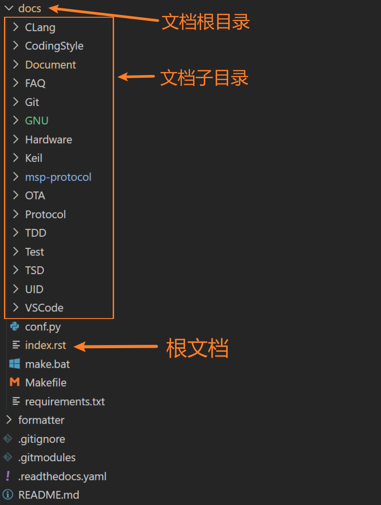
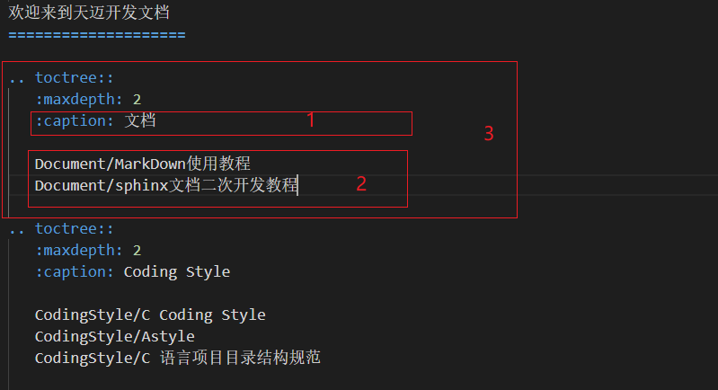
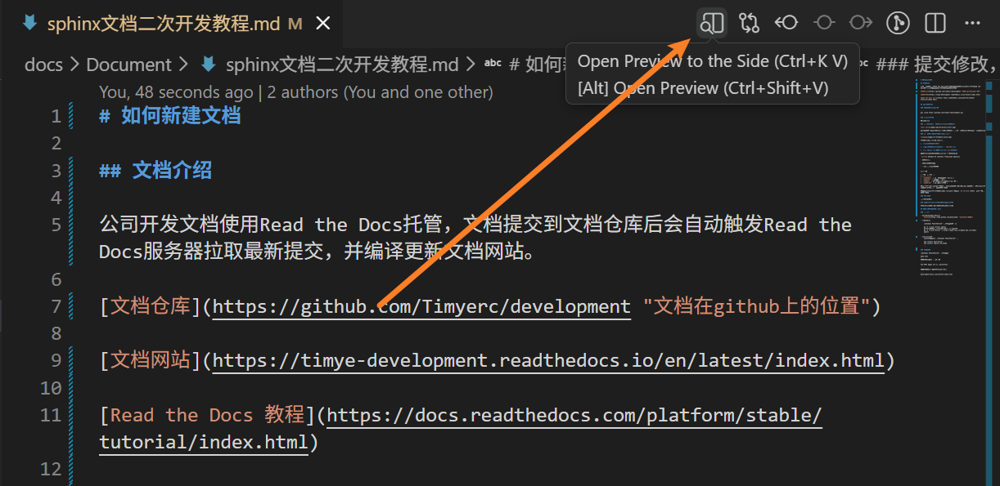

# 如何新建文档

## 文档介绍

公司开发文档使用Read the Docs托管，文档提交到文档仓库后会自动触发Read the Docs服务器拉取最新提交，并编译更新文档网站。

[文档仓库](https://github.com/Timyerc/development "文档在github上的位置")

[文档网站](https://timye-development.readthedocs.io/en/latest/index.html)

[Read the Docs 教程](https://docs.readthedocs.com/platform/stable/tutorial/index.html)


## 新建文档步骤

### 克隆文档仓库到本地

```
git clone https://github.com/Timyerc/development.git
```

### 创建修改分支

如：add-xxx

### 使用VSCode打开文档仓库并新建文档

目录结构如下：



新建的文档放到对应子目录中，如果文档不属于任何一个子目录，可以新建一个新的目录。

新建文档的格式为[MarkDown](MarkDown使用教程.md)，文件后缀为`.md`

### 添加文档路径到根文档(index.rst)中



根文档(index.rst)的主要作用

1. **定义文档首页内容**
  
2. **指定文档的目录结构（通过 `toctree`）**
  
3. **是 Sphinx 自动生成导航栏、侧边栏的核心**
  
你可以把它理解成“文档的导航菜单 + 首页介绍”。

`toctree`（Table Of Contents Tree）告诉 Sphinx：

- 文档有哪些
  
- 层级结构如何组织
  
- 侧边栏和菜单怎么呈现
  

常见参数

| 参数  | 含义  |
| --- | --- |
| `:maxdepth:` | 展开层级深度（侧边栏） |
| `:caption:` | 给章节加标题 |
| `:hidden:` | 不在正文显示，但仍在菜单出现 |
| `:numbered:` | 给每章自动编号 |

如上图2框住的是目录下放置的归于该目录的文档路径，如果新增的文档属于这个目录，则只需要在2框下行增加新的文档路径。

如需新建目录，则在根文档(index.rst)对应位置新建一个`toctree`，并添加对应参数和文档路径。

### 预览文档

使用VSCode预览，点击VSCode界面右上角预览按钮，在文档侧边打开预览界面。



文档预览没问题再执行下面步骤。

### 提交修改，并创建PR请求合并到main分支

合并后确定文档是否在文档网站上正确显示。

## 如何本地编译文档为html

### 前期准备

- 下载Python3（3.0以上）
    [Python](https://www.python.org/downloads/ "python下载地址")

- 安装sphinx

    在Windows PowerShell下执行以下指令之一：
    ```
    py -3 -m pip install sphinx
    #国内用户推荐使用清华源安装，使用-i指定源
    py -3 -m pip install -i https://pypi.tuna.tsinghua.edu.cn/simple sphinx
    ```

- 相应扩展安装
    以下安装指令建议在Windows PowerShell下执行
    ```
    pip install myst-parser
    pip install sphinx_rtd_theme

    ```

### 编译文档

在Windows PowerShell下执行以下指令
```
make html
```
成功编译后最后一行会出现

```
The HTML pages are in _build\html.
```

成功编译之后前往下述目录查看效果

```
development\docs\_build\html\index.html
```