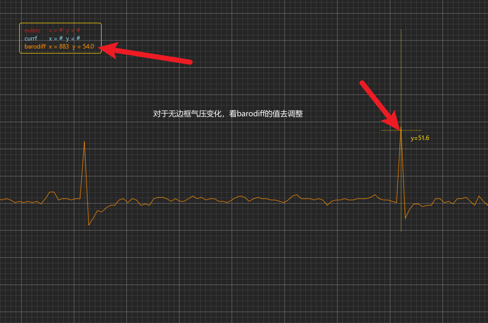
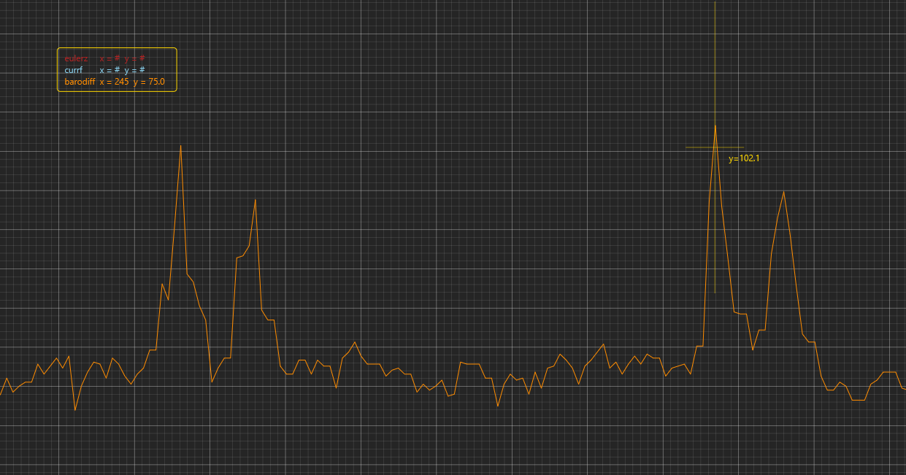
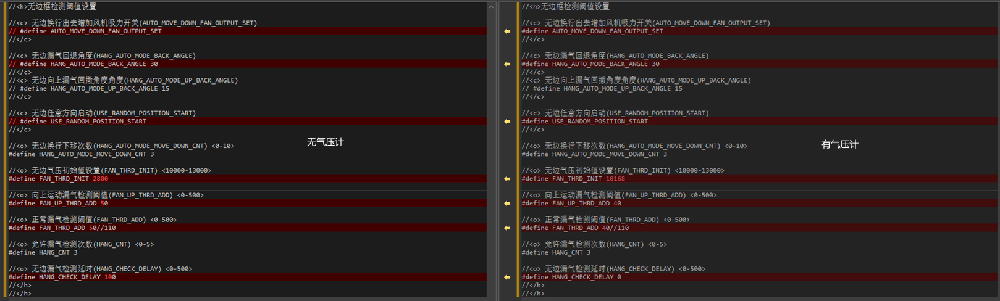
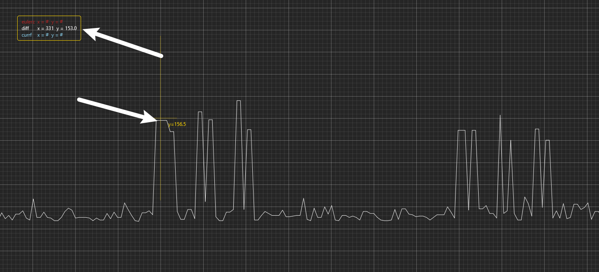
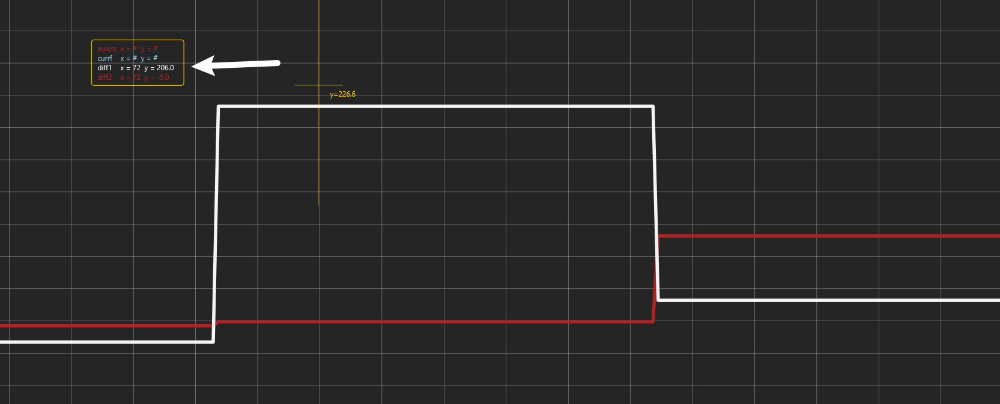
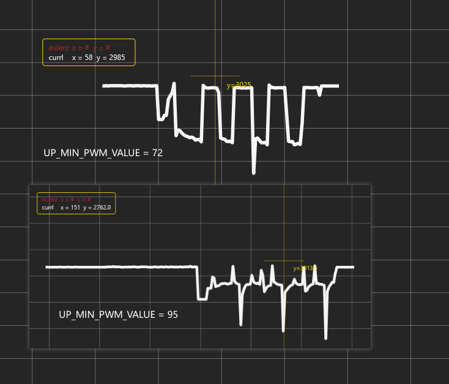
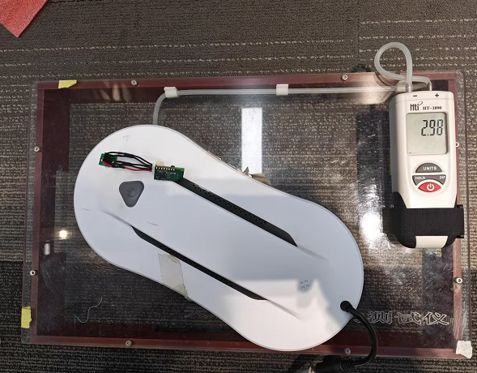

# 圆形机常见问题

## 气压问题 

---

### 问题

机器无边框检测不灵敏、漏气等问题。

### 解决办法

我们可以使用串口调试助手发送`MSP_BARO_DIFF`来获取气压变化值。

参考图片：带气压计

不带气压计

通过串口助手看到的`barodiff`值来判断当前的气压差值是多少。
对应的修改代码中的阈值进行修改。 
#### 带气压计 参考项目`EHDC04_H0T0L0C2B_S10B`

```
//<o> 无边气压初始值设置(FAN_THRD_INIT) <10000-13000>
#define FAN_THRD_INIT 10168
 
//<o> 向上运动漏气检测阈值(FAN_UP_THRD_ADD) <0-500>
#define FAN_UP_THRD_ADD 40

//<o> 正常漏气检测阈值(FAN_THRD_ADD) <0-500>
#define FAN_THRD_ADD 40
```
#### 不带气压计 参考项目`EHDC04_H0T0L0A2B_S10B`
```
//<o> 无边气压初始值设置(FAN_THRD_INIT) <10000-13000>
#define FAN_THRD_INIT 2800

//<o> 向上运动漏气检测阈值(FAN_UP_THRD_ADD) <0-500>
#define FAN_UP_THRD_ADD 50

//<o> 正常漏气检测阈值(FAN_THRD_ADD) <0-500>
#define FAN_THRD_ADD 50
```
带不带气压计这些阈值参数有很大区别，需要特定机器去调试。
当然对于带不带气压计还有其他参数会有调整还有其他方面参数
宏开关：`USE_FAN_OUTPUT_PID` `BARO`



## 陀螺仪问题 

---

### 问题

机器有边框检测不灵敏、底部不停机等问题。

### 解决办法

我们可以使用串口调试助手发送`MSP_GYRO_DETECT`来获取陀螺仪变化值。

参考图片：
撞边

通过串口助手看到的`diff`值来判断当前的陀螺仪差值是多少，
对应的修改代码中的阈值进行修改。 

```
//<o> 检测边缘陀螺仪变化值阈值(GYRO_DIFF_THRESHOLD) <0-500>
#define GYRO_DIFF_THRESHOLD 120

//<o> 检测边缘堵转陀螺仪阈值(GYRO_THRESHOLD) <0-500>
#define GYRO_THRESHOLD 200

//<o> 向上运动时陀螺仪变化阈值(GYRO_UP_DIFF_THRESHOLD) <0-500>
#define GYRO_UP_DIFF_THRESHOLD 100

//<o> 向上运动时陀螺仪堵转阈值(GYRO_UP_THRESHOLD) <0-100>
#define GYRO_UP_THRESHOLD 100
```
通过`MSP_EDGE_BOTTOM_DETECT`来获取底部停机阈值。

底部停机

通过串口助手看`diff1` `diff2`看底部停机差值。
```
//<o> 底部停机陀螺仪检测方式阈值(EDGE_BOTTOM_GYRO_DIFF) <0-300>
#define EDGE_BOTTOM_GYRO_DIFF 120
```

## 电机问题 

---

### 问题

机器打滑下坠，一个轮子不动，另一个转

### 解决办法

我们可以使用串口调试助手发送`MSP_ANALOG`来获取原始ADC值。（首先应该确认边轮线序是否正确）

参考图片：
电机ADC值

通过串口助手看到的`currl`值来看当前左电机adc值，
对应的修改代码中的阈值进行修改。 

```
//<o> 运动边轮电机最小输出(MIN_PWM_VALUE) <0-100>
#define MIN_PWM_VALUE 75
//<o> 向上运动边轮电机最小输出(UP_MIN_PWM_VALUE) <0-100>
#define UP_MIN_PWM_VALUE 72
```

## 吸力问题 

---

### 问题

吸力不够

### 解决办法

我们可以使用吸力测试仪来测试吸力大小(有漏气情况先解决结构问题)

参考图片：



通过吸力测试仪可以看到吸力大小，根据客户需求进行调节。 

**默认吸力占空比调节**
```
//<o> 默认状态风机占空比(PWMVALUE) <0-100>
#define PWMVALUE 73

#define FAN_PWMVALUE_AT_IDLE PWMVALUE
```
**三级吸力占空比调节**
```
//<h> 风机吸力等级调节配置
//<c> 使用风机等级调节开关(USE_FAN_LEVEL)
//#define USE_FAN_LEVEL
//</c>
#ifdef USE_FAN_LEVEL
//<o> 一级吸力(FAN_LEVEL_1) <0-100>
#define FAN_LEVEL_1 85

//<o> 二级吸力(FAN_LEVEL_2) <0-100>
#define FAN_LEVEL_2 92

//<o> 三级吸力(FAN_LEVEL_3) <0-100>
#define FAN_LEVEL_3 95

//<o FAN_DEFAULT_INDEX> 使用中的风机吸力等级(FAN_DEFAULT_INDEX)
// <FAN_LEVEL_1=> FAN_LEVEL_1 <FAN_LEVEL_2=> FAN_LEVEL_2 <FAN_LEVEL_3=> FAN_LEVEL_3
#define FAN_DEFAULT_INDEX FAN_LEVEL_3

#endif
//</h>
```
**闭环吸力调节**
```
//<h>风机闭环吸力调节配置
//<c> 使用闭环吸力调节开关(USE_FAN_OUTPUT_PID)
// #define USE_FAN_OUTPUT_PID
//</c>
//<c> 不限制启动吸力范围(FAN_START_PWMVALUE_NO_LIMIT)
// #define FAN_START_PWMVALUE_NO_LIMIT
//</c>

//<o> 闭环吸力最小吸力值(FAN_PWMVALUE_MIN) <0-100>
#define FAN_PWMVALUE_MIN 70

//<o> 闭环吸力最大吸力值(FAN_PWMVALUE_MAX) <0-100>
#define FAN_PWMVALUE_MAX 90

//<o> 闭环吸力默认气压值(DEFAULT_TARGET_FAN_PWMVALUE) <0-1000>
#define DEFAULT_TARGET_FAN_PWMVALUE 275

//<o> 闭环吸力最大气压值(MAX_TARGET_FAN_PWMVALUE) <0-1000>
#define MAX_TARGET_FAN_PWMVALUE 300

//<o> 闭环吸力最小气压值(MIN_TARGET_FAN_PWMVALUE) <0-1000>
#define MIN_TARGET_FAN_PWMVALUE 250

//</h>
```
**动态吸力调节**
```
//<h>风机动态吸力调节配置
//<c> 使用动态吸力调节开关(USE_FAN_LEVEL_DYNAMIC_COMP)
// #define USE_FAN_LEVEL_DYNAMIC_COMP
//</c>
//<o WHEEL_CURRENT_MAX> 动态吸力调节边轮电流阈值调节上限 单位A(WHEEL_CURRENT_MAX) <0-9.9>
#define WHEEL_CURRENT_MAX 1.2

//<o> 动态吸力调节边轮电流阈值调节下限 单位A(PWMVALUE_MAX) <0-9.9>
#define WHEEL_CURRENT_MIN 0.7

//<o> 边轮电机电流采集电路运放正输入端电压 单位V(PWMVALUE_MAX) <0-9.9>
#define WHEEL_CURRENT_VF 0.55

//<o> 边轮电机电流采集电路运放放大倍数 (PWMVALUE_MAX) <0-9.9>
#define WHEEL_CURRENT_AD 3.4

//<o> 边轮电机电流采集电路运放检流电阻 单位Ω(PWMVALUE_MAX) <0-9.9999>
#define WHEEL_CURRENT_RZ 0.034

#ifdef USE_FAN_LEVEL_DYNAMIC_COMP

#ifndef USE_FAN_OUTPUT_PID
//<o> 动态吸力调节最大值(PWMVALUE_MAX) <0-100>
#define PWMVALUE_MAX 70

//<o> 动态吸力调节最小值(PWMVALUE_MIN) <0-100>
#define PWMVALUE_MIN 90

#endif

#endif
//</h>
```
