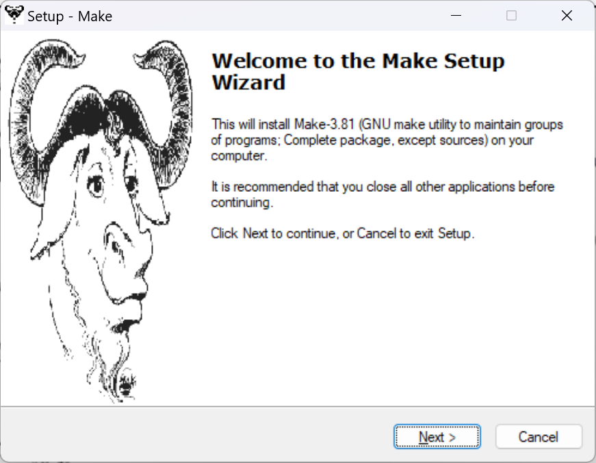
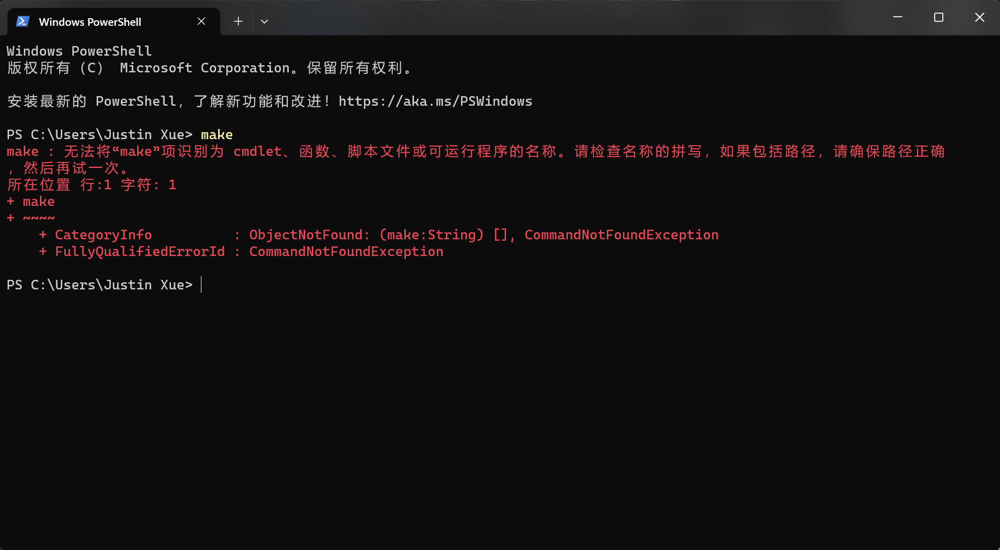
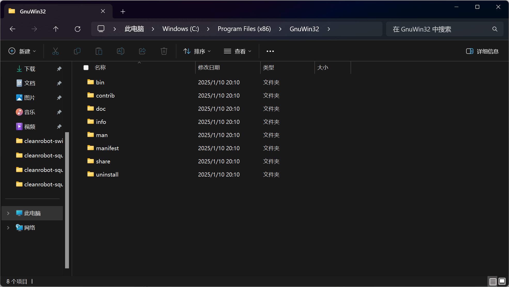
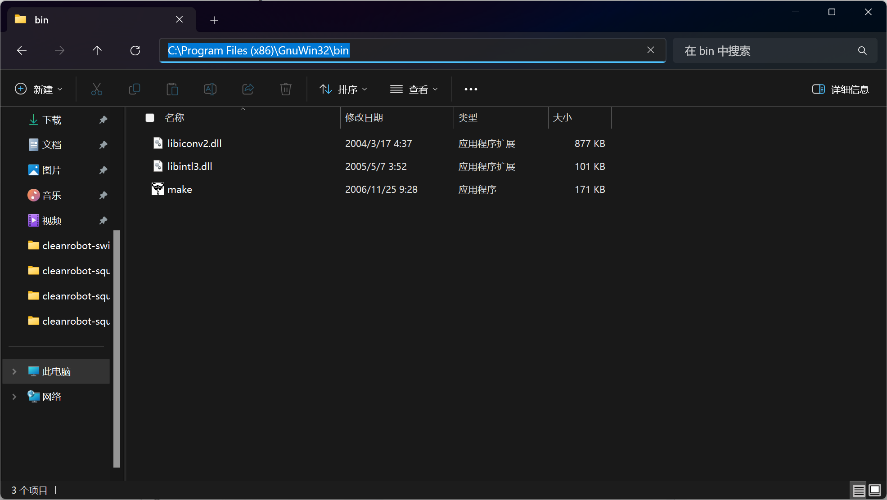
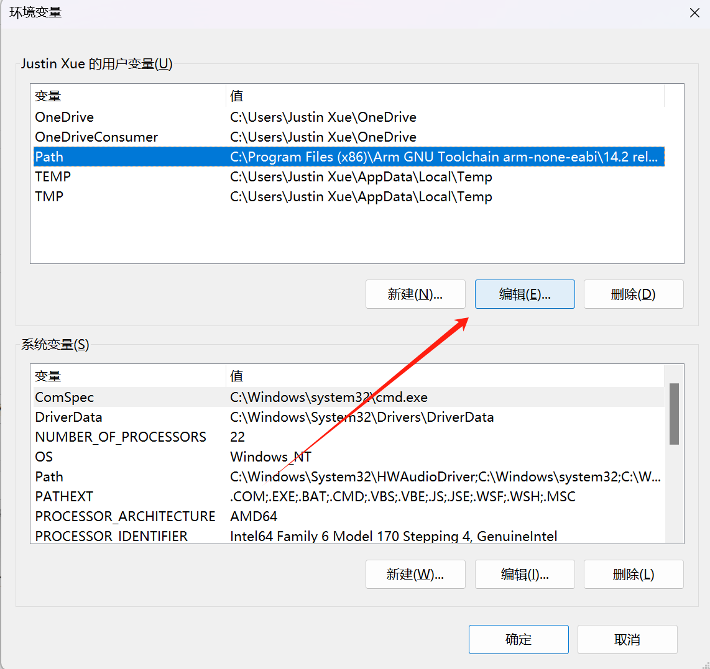
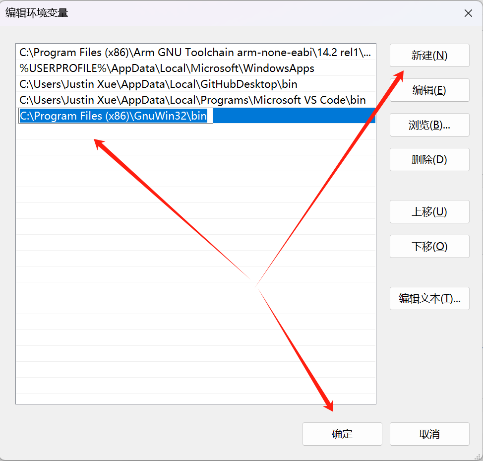
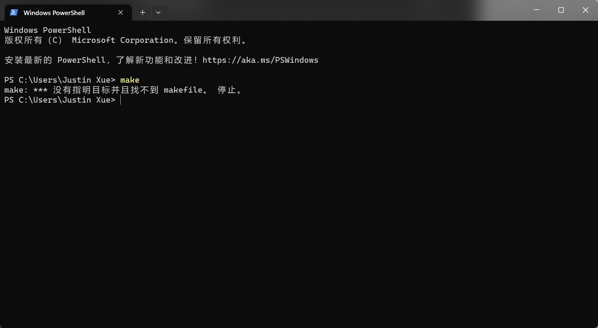

# Install Make

GNU Make是一个工具，它控制从程序的源文件中生成程序的可执行文件和其他非源文件。make从一个名为makefile的文件中获取如何构建程序的知识，该文件列出了每个非源文件以及如何从其他文件中计算它。当你编写一个程序时，你应该为它编写一个makefile，这样就可以使用Make来构建和安装程序。

## 为Window安装Make工具

打开如下网址：[https://gnuwin32.sourceforge.net/packages/make.htm](https://gnuwin32.sourceforge.net/packages/make.htm)

点击如下图片红圈任意一处下载安装包。

点击下载的可执行文件开始安装，点击Next > Next > Next (注意接受协议)，记住安装的位置。

安装完成后打开终端，输入make并回车，可能会提示无法执行。

你需要把make的安装路径添加的环境变量。

打开make的安装路径，并进入bin目录。

在bin目录你会看到make。

拷贝路径，搜索环境变量并进入设置。

点击弹出的对话框中的环境变量按钮。

在用户变量中找到Path。

点击新建，粘贴拷贝的路径并点击确定，返回上一级再点击确定。

添加完环境变量重启电脑后再次打开终端并输入make。

恭喜你完成了。