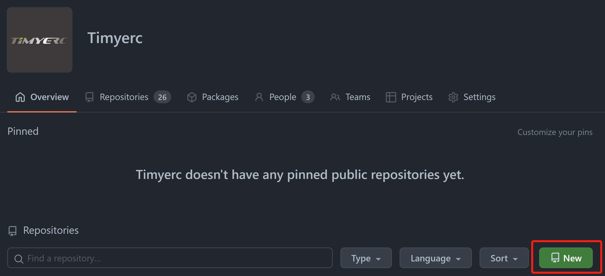
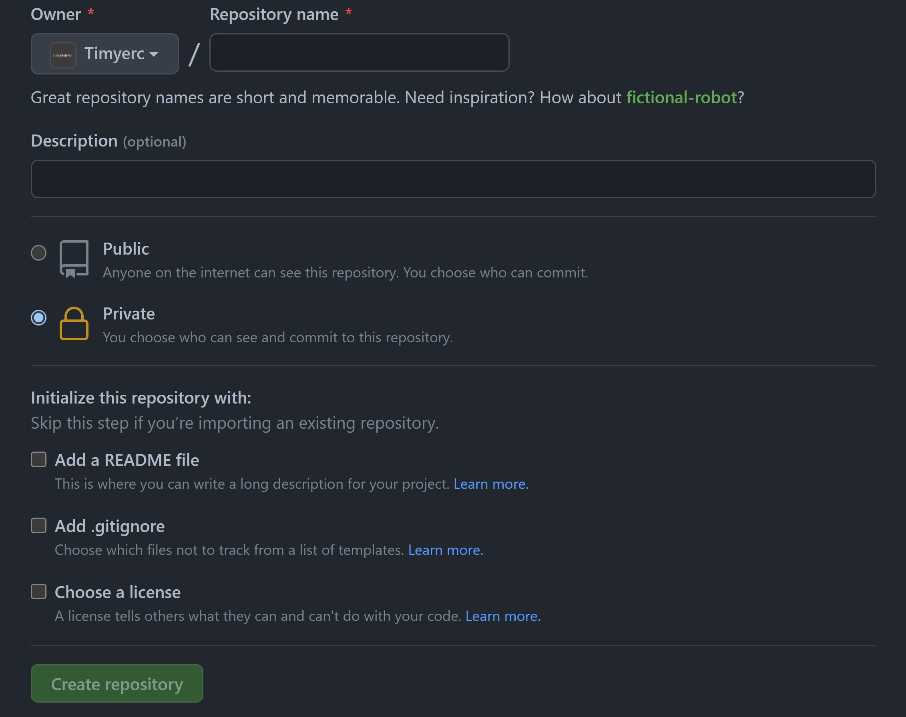

# Git使用详解

## 创建本地新的仓库

创建工程文件夹，进入创建的文件夹，执行以下命令创建新的本地git仓库：

`git init`

## 克隆远程仓库到本地

获取远程仓库链接，执行以下命令克隆远程仓库到本地：

`git clone 远程仓库链接`

## 为新工程创建GitHub仓库

1. 登录GitHub账号，进去Timyerc公司账号。
2. 点击New按钮进入创建新仓库页面。

3. 在对应的输入框中填写仓库信息，可以勾选需要初始添加的文件，如README、.gitignore等。

4. 创建好后克隆仓库到本地。

## 为已有本地工程创建GitHub仓库

如果本地已经有一个git仓库，需要为本地仓库创建一个对应的远程GitHub仓库，创建流程同上，
但在创建仓库的页面不要选择添加任何初始文件。

设置本地仓库的远程仓库链接为已创建的GitHub仓库链接：

`git remote add origin 远程仓库链接`

设置好后推送本地代码到远程仓库：

`git push -u origin 分支名`

## .gitignore

根据你的工程类型参考对应的模板为你的工程添加.gitignore文件。

.gitignore使用参考：

[https://git-scm.com/docs/gitignore](https://git-scm.com/docs/gitignore)

[https://gist.github.com/jstnlvns/ebaa046fae16543cc9efc7f24bcd0e31](https://gist.github.com/jstnlvns/ebaa046fae16543cc9efc7f24bcd0e31)