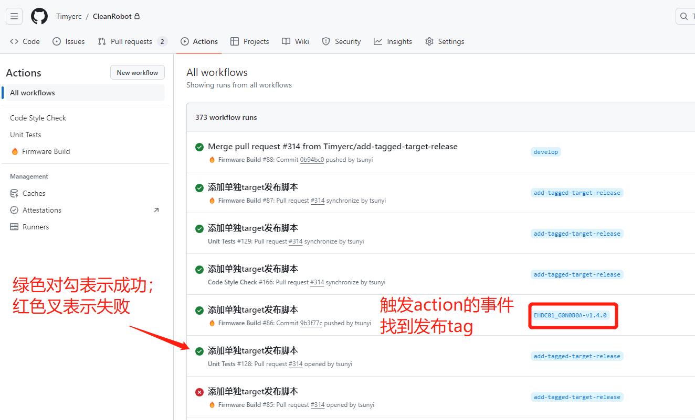
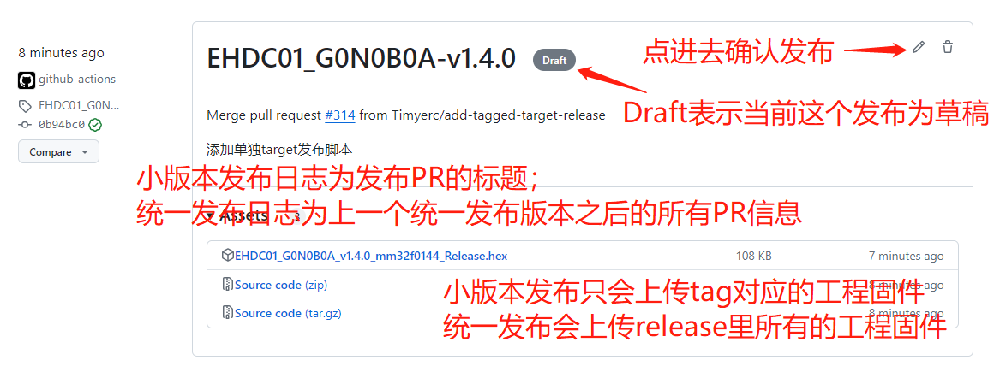

# Github自动发布

@Justin 2024/6/21

## 发布流程

### 创建发布分支

**小版本发布**

原则上小版本主要是打一些补丁，

从`main`分支创建新的补丁分支，新分支的命名方式：`patch-xxx`, 例如：`patch-modify-EHDC01_G0N0B0A-fan-pwm`。

如果小版本需要`develop`分支的新功能，可以从`develop`上创建发布分支，且发布分支需要合并到`develop`分支。

**统一版本发布**

统一版本发布从`develop`分支创建发布分支，新分支的命名方式：`release-v版本`，例如：`release-v1.4.0`。

### 提交PR，合并发布分支到`main`分支

修改完成后提交PR到`main`分支，审核通过后合并到`main`分支。

### 在`main`分支打发布Tag，触发Github action自动发布

合并后在`main`分支上打版本`tag`，`tag`格式参考下方[Tag格式](#tag格式)

推送新的`tag`到远程仓库，检测自动发布action是否执行成功。

推送成功后Github action会自动创建新的发布，注意action创建的发布为草稿，需要自己手动修改publish。

### 确认发布

检测发布信息是否正确，以及发布日志是否需要修改。确定无误后电机Publish release按钮正式发布。

## Tag格式

### 小版本发布

[工程名称]-v[主板版本号].[小版本号].[补丁号]

注：
- 实际没有方括号，这里只是为了区分；
- 工程名称需与实际工程名称完全一致；
- 版本号需与实际版本号完全一致。

例如：`EHDC01_G0N0B0A-v1.4.1`

### 统一版本发布

圆形

CleanRobot-v[主板版本号].[小版本号].[补丁号]

方形

CleanRobot-Square-v[主板版本号].[小版本号].[补丁号]