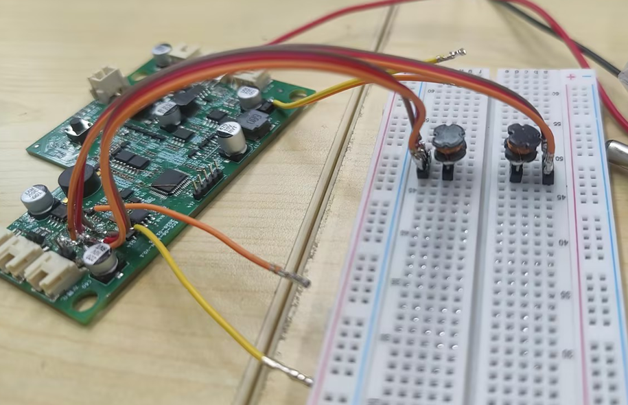
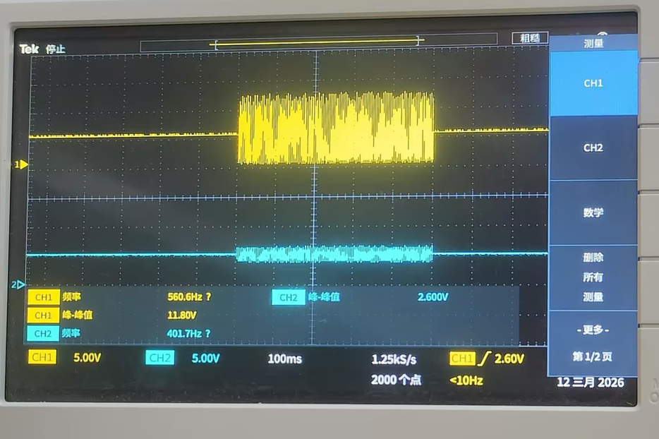
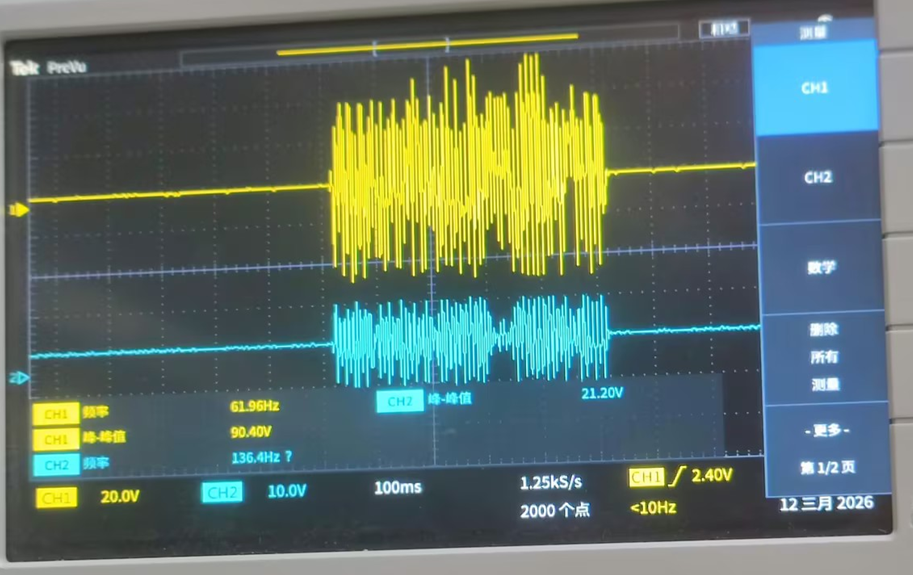
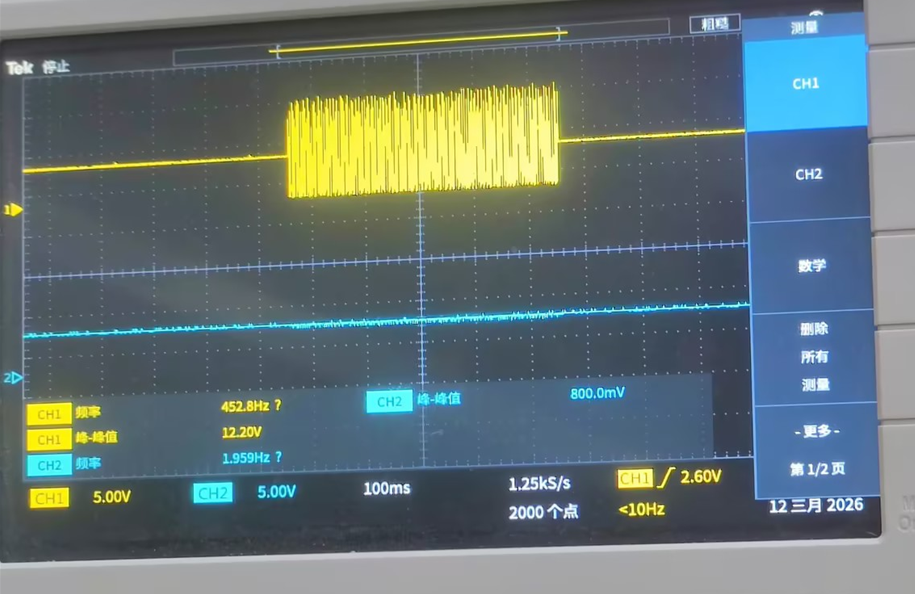
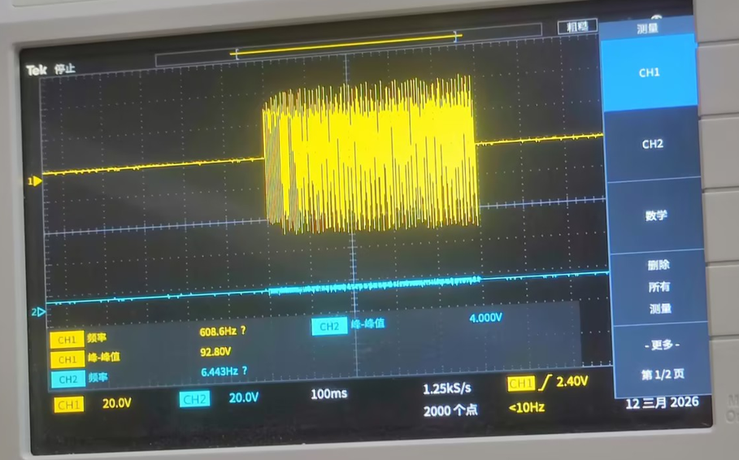

# FAQ

## 雾化片电感安全距离验证

1.两个三角电感间距5mm，雾化正常，顺序控制准确 

2.两个三角电感间距4mm，一端雾化开启时，另一端有瞬间启动后立即关闭的现象，伴有微量水雾溢出

3.两个三角电感间距小于等于3mm时，问题复现，两路雾化同时启动

4.测试环境

5.异常波形数据（第一张为三角电感的2脚波形，第二张为三角电感的）

6.正常波形数据（第一张为三角电感的2脚波形，第二张为三角电感的）

