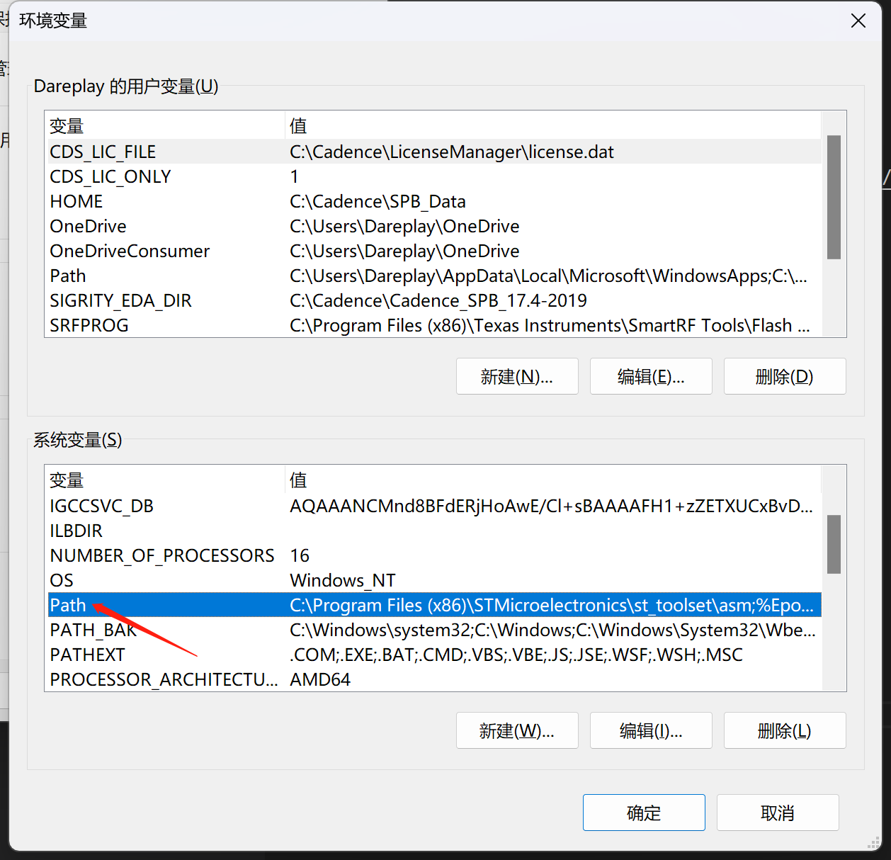
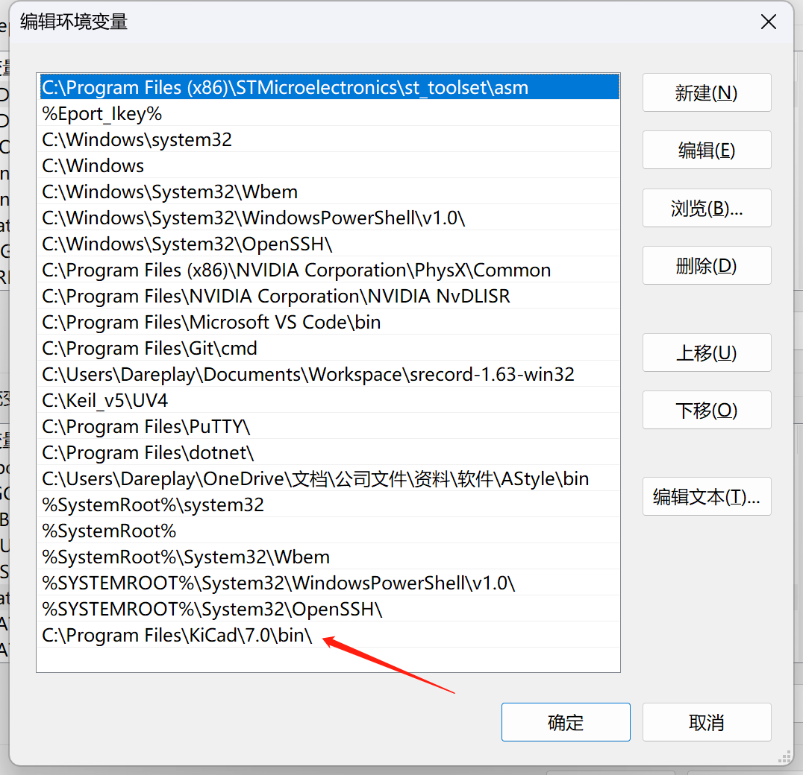
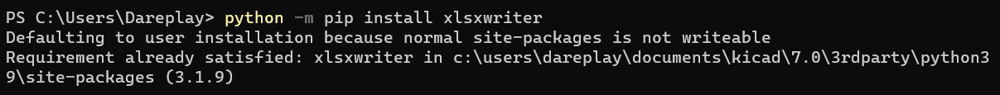
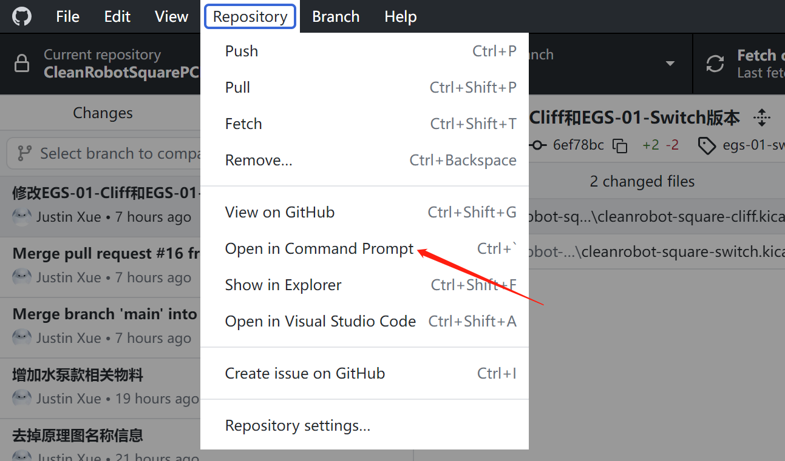
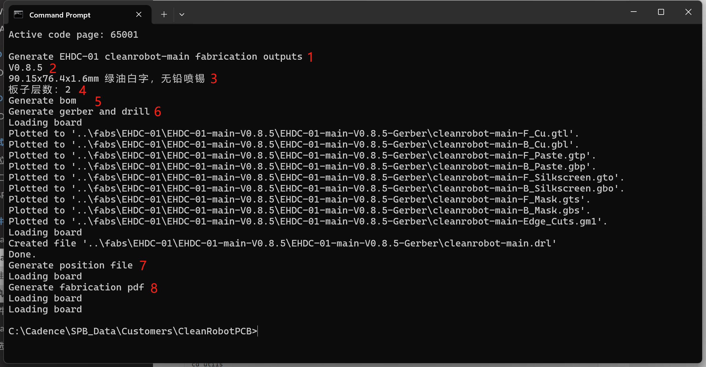

# Kicad使用脚本生成生产文件

作者@Justin

## 安装相关软件

### 安装[Kicad](https://www.kicad.org/)

添加Kicad安装目录下的bin文件夹路径到系统环境变量，如果安装了新的Kicad版本，需把环境变量改为新版本的安装目录。

*如下目录仅供参考，按照实际目录添加*

```
C:\Program Files\KiCad\版本\bin\
```




***环境变量设置好后需要重启电脑才会生效，切记重启后再执行下面步骤。***

### 安装[Python](https://www.python.org/)依赖库

打开Windows终端，输入如下命令并回车

```
python -m pip install xlsxwriter
python -m pip install pymupdf
python -m pip install --upgrade pywin32
```



## 执行脚本生成生产文件

打开Windows终端，进入工程仓库目录

建议通过Github Desktop进入终端，这样终端会默认进入仓库目录。



### 在工程根目录执行如下脚本查看命令帮助

```
> python .\utils\ci.py -h
usage: ci.py [-h] {rc,fab,pdf} ...

PCB设计CI脚本

positional arguments:
  {rc,fab,pdf}  子命令
    rc          检测原理图ERC, 或者PCB DRC
    fab         生成生产文件, 如BOM, GERBER, 坐标, 贴片图等
    pdf         生成带水印的原理图、PCB和BOM的PDF文件

options:
  -h, --help    show this help message and exit
```

ci.py有三个子命令，分别是rc, fab和pdf。 rc用于检测原理图ERC, 或者PCB DRC；fab用于生成生产文件, 如BOM, GERBER, 坐标, 贴片图等；pdf用于生成带水印的原理图、PCB和BOM的PDF文件。

每个子命令的使用方法可以查看子命令的帮助：

```
python utils\ci.py 子命令 -h
```

例如：

```
> python .\utils\ci.py fab -h
usage: ci.py fab [-h] [-t TAG] [-n] [-j] [-f FILE_LIST [FILE_LIST ...]] [folder]

positional arguments:
  folder                生成对应文件夹下或所有子文件夹下的PCB的生产文件

options:
  -h, --help            show this help message and exit
  -t TAG, --tag TAG     生成tag对应的PCB生产文件, 不用输入文件或者文件夹名
  -n, --ncs             BOM输出不贴的元器件
  -j, --jlc             生成嘉立创贴片相关资料
  -f FILE_LIST [FILE_LIST ...], --file_list FILE_LIST [FILE_LIST ...]
                        一个或者多个PCB文件
```

### 使用举例

#### 生成EGS-01项目下的所有板子的生产文件

```
python .\utils\ci.py fab EGS-01
```

#### 生成EGS-01项目下主板的生产文件

```
python .\utils\ci.py fab EGS-01\cleanrobot-square-main
```

#### 生成EGS-01项目下主板的嘉立创生产文件

```
python .\utils\ci.py fab -j EGS-01\cleanrobot-square-main
```

#### 生成指定tag的生产文件

```
python .\utils\ci.py fab -t egs-01-main-v0.5
```

查看log信息，确定是否有报错



1. 指示生成具体哪个板子
2. 板子版本
3. 板子尺寸和工艺信息
4. 板子层数
5. 指示生成BOM
6. 指示生成Gerber
7. 指示生成坐标文件
8. 指示生成贴片图

## 生成带水印的原理图、PCB和BOM文件

在工程根目录执行如下命令：

```
# 生成项目下的所有电路板资料
python utils\ci.py pdf 总的项目名称

# 生成项目下的指定的电路板资料
python utils\ci.py pdf 总的项目名称\具体的电路板

例子：
python utils\ci.py pdf EHDS-01

python utils\ci.py pdf EHDS-01\cleanrobot-square-main
```