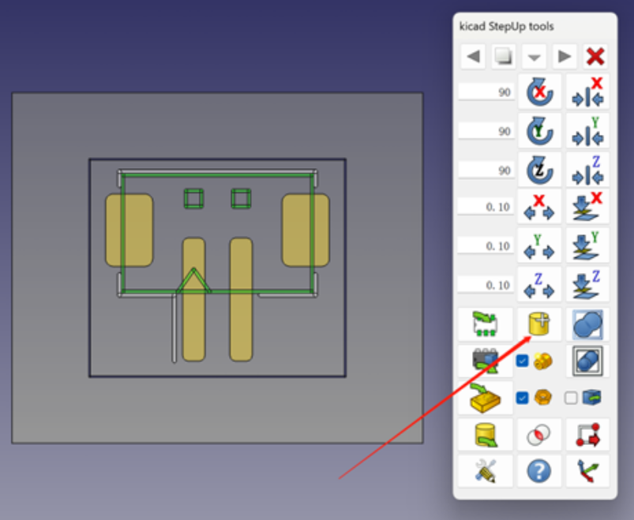

# Kicad封装添加3D模型

## 准备

[FreeCAD 下载](https://www.freecad.org/)

[KiCADSetup插件安装](https://github.com/easyw/kicadStepUpMod/)

## 在FreeCAD中启动KiCadStepUp Workbench

## 导入需要添加3D模型的封装

## 导入3D模型文件

## 打开工具栏进行调整

## 选择3d模型然后进行位置调整

## 选择3d模型重命名并导出

