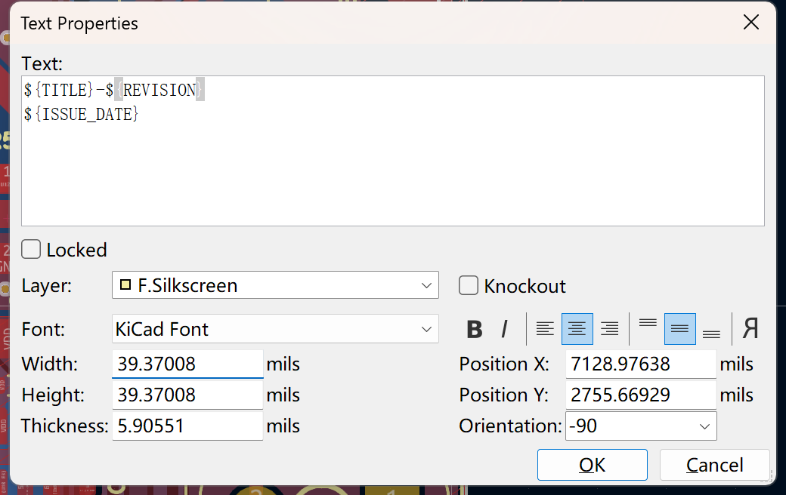
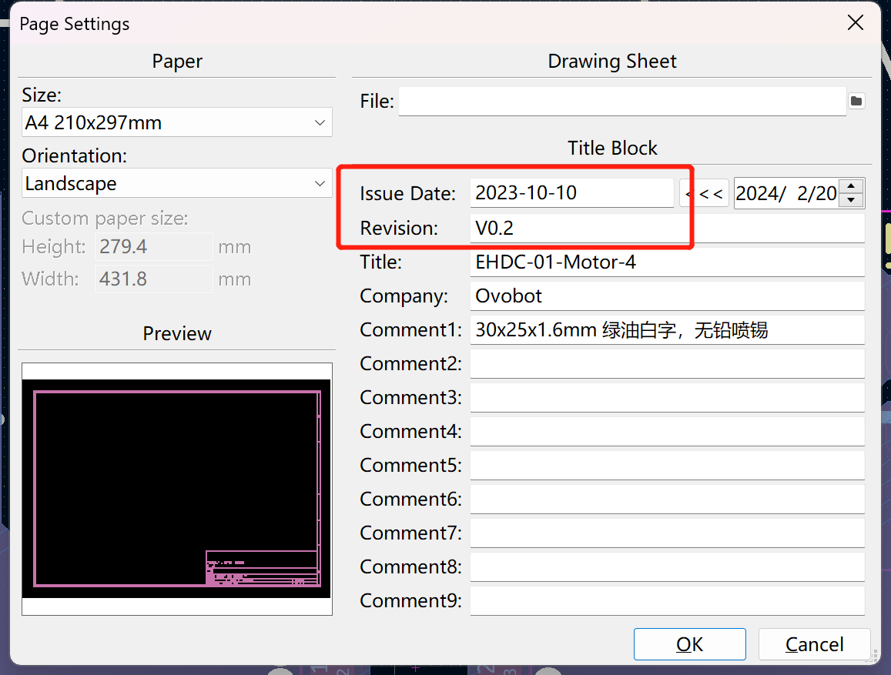
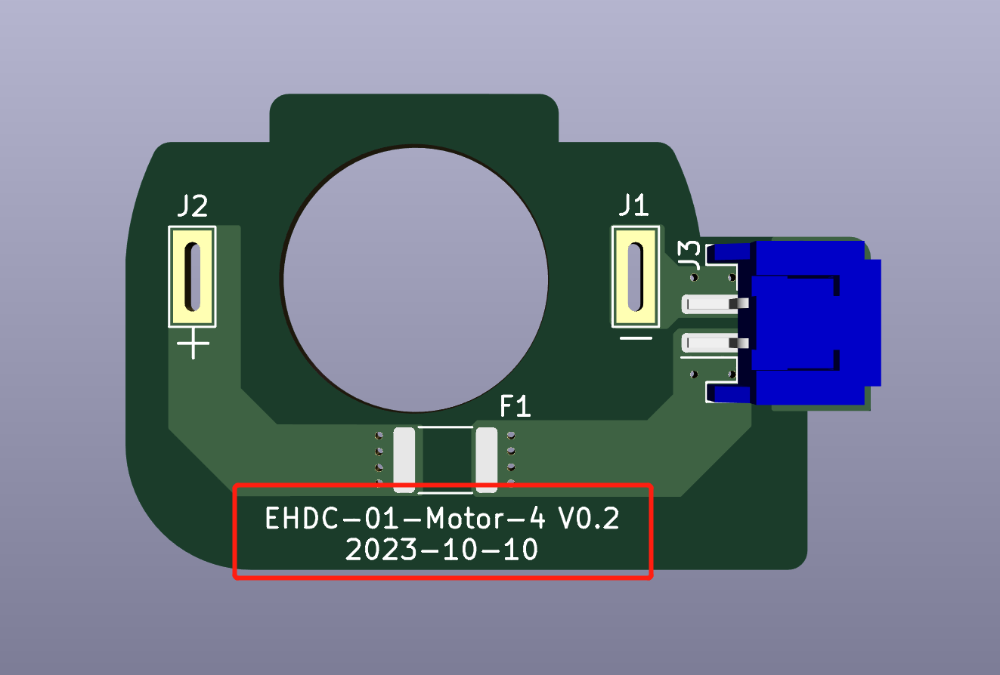
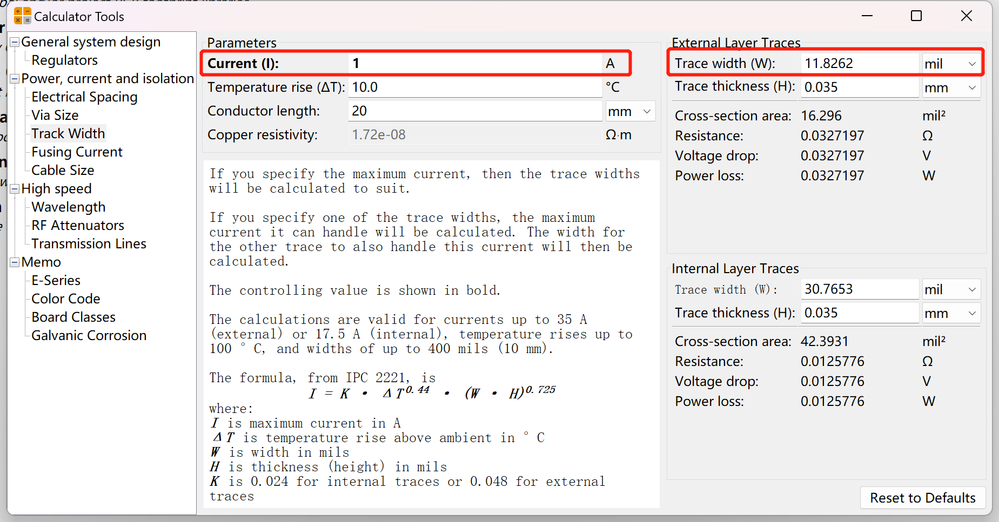
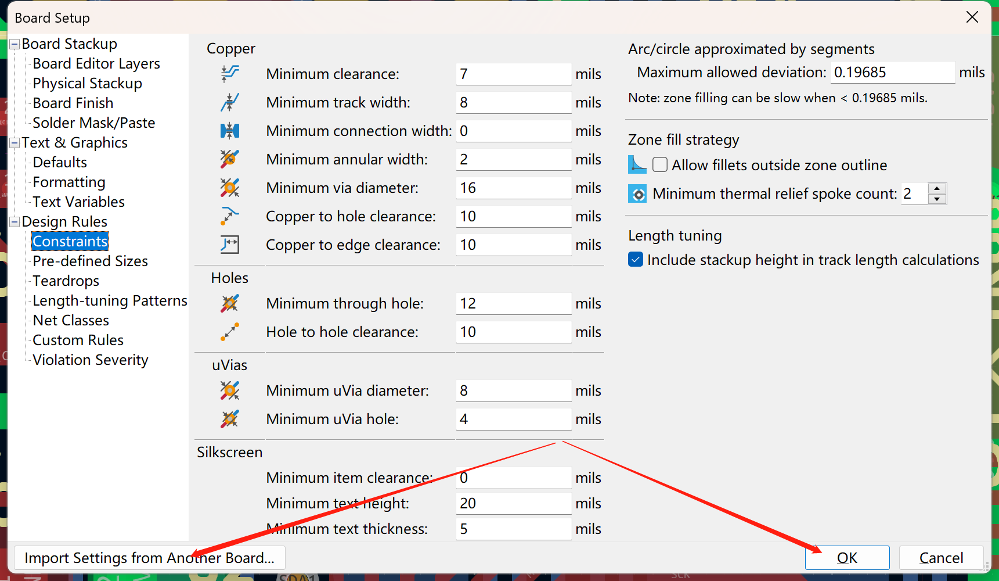
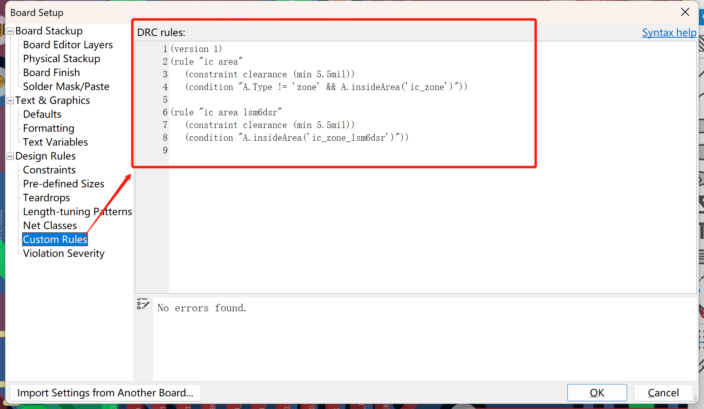
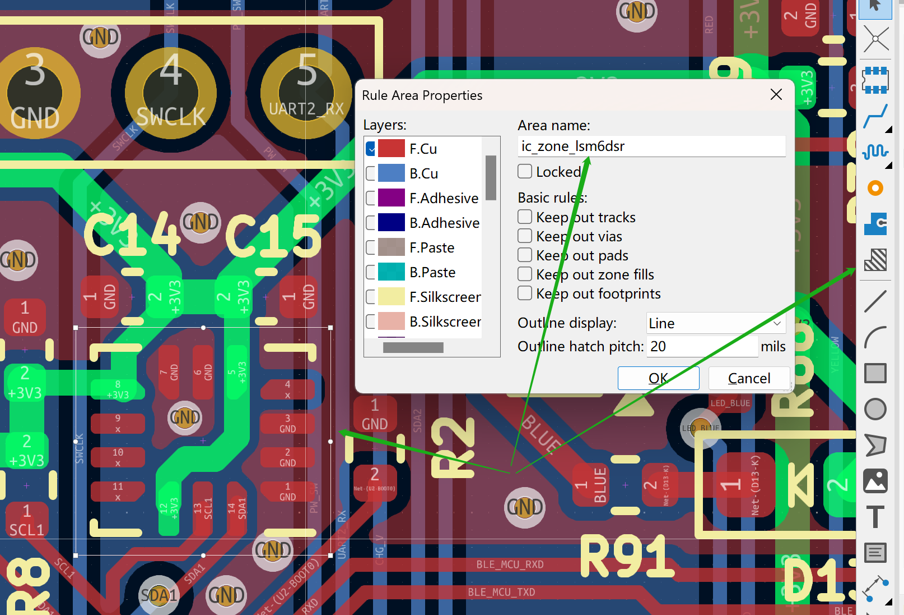

# Kicad设计规范

## PCB版本和日期丝印使用变量

板子标题名称：`${TITLE}`

版本的变量是：`${REVISION}`

日期的变量是：`${ISSUE_DATE}`

如PCB的丝印设置如下：



则对应变量会被实际的页面设置值替代：



显示的效果如下：



## 设计使用英制单位mil

常见的对应关系如下：

| 英制 | 公制 |
| ----------- | ----------- |
| 10mil | 0.254mm |
| 20mil | 0.508mm |
| 30mil | 0.762mm |
| 40mil | 1.016mm |
| 100mil | 2.54mm |

一般密度的板子信号线使用8mil，电源线根据走电流的大小设置，一般原则大于信号线的宽度。

可以使用如下Kicad的计算工具计算：



得到的结果向上取整，如上可以设置为15mil。一般取值是10mil、15mil、20mil等5的倍数。

过孔一般使用24/12mil，即外径24mil，内孔直径12mil。

## 走线

| PCB密度 | 间距 | 线宽 | 过孔外径 | 过孔孔径 | 
| ------- | ---- | ---- | ----- | ------ |
| 低密度板 | 8mil | 8mil | 24mil | 12mil |
| 中等密度 | 6mil | 6mil | 16mil | 8mil |

### 同一网络过孔规范

原则上过孔控制在4个以内。

## 电源网络线宽如何确定

参考约束规则；

如果没有约束规则，需了解电路实际电流大小再确定线宽；


## 约束规则

原则上设计新的PCB板时需要导入库里默认的工程配置。



两层板的默认配置工程目录如下：

```
Library\kicad_dr_2_m\kicad_dr_2_m.kicad_pcb
```

### 用户自定义规则

如下定义了两个自定义规则，一个是`ic area`，间距为5.5mil，约束条件是所有在`ic_zone`约束区域内的除了铜皮之外的所有对象；另外一个是`ic area lsm6dsr`，约束间距是5.5mil，约束条件是所有在`ic_zone_lsm6dsr`约束区域内的所有对象。

```
(version 1)
(rule "ic area"
   (constraint clearance (min 5.5mil))
   (condition "A.Type != 'zone' && A.insideArea('ic_zone')"))

(rule "ic area lsm6dsr"
   (constraint clearance (min 5.5mil))
   (condition "A.insideArea('ic_zone_lsm6dsr')"))
```



当有部分IC不适用当前默认规则时（如引脚间距小于默认规则），可以定义自定义规则，然后在IC区域画一个约束区域，并给约束区域设置一个名称，名称需要与自定义规则中区域名称对应。



## PCB封装设计规范

参考如下文档：

[如何新建封装](https://docs.kicad.org/8.0/zh/getting_started_in_kicad/getting_started_in_kicad.html#%E6%96%B0%E5%BB%BA%E5%B0%81%E8%A3%85)

[Kicad Library Conventions](https://klc.kicad.org/footprint/f5/f5.2.html)

### 丝印层（Silkcreen）

- 线径：0.12mm
- 距离Fab层：0.11mm
- 距离铜皮：0.2mm

### 制造层（Fab）

- 线径：0.1mm
- 为元器件的外形，通常使用中间值

### 外框层（Courtyart）

- 线径：0.05mm

- 距离Fab层：
  - 正常为0.25mm
  - 比0603小的封装可以缩小为0.15mm
  - 连接器为0.5mm

## ✅ IPC-7351B 中 SOP 封装的焊盘设计标准

IPC-7351B 中将封装分为三种密度等级（Density Level）：
- **Level A**：宽松型（适用于手工焊接或维修）
- **Level B**：普通型（默认，适用于大多数消费电子）
- **Level C**：紧凑型（适用于高密度布板）

### 📏 SOP 封装的标准焊盘参数（以 Level B 为例）

#### 焊盘长度（Pad Length）计算方式：

```
Pad Length = Lead Length + Toe + Heel
```

其中：
- **Lead Length**：引脚本身的长度
- **Toe（前伸）**：引脚超出焊盘的部分（推荐 0.5mm 左右）
- **Heel（回缩）**：焊盘缩进部分，用于支撑引脚末端（推荐 0.25mm 左右）

#### 焊盘宽度（Pad Width）：

- 通常比引脚宽度大一些，例如：
  ```
  Pad Width = Lead Width + 0.2mm（左右间隙）
  ```

#### 焊盘间距：

- 参考引脚间距（pitch）设计，**Pad-to-Pad 间距 = pitch - Pad Width**
- 例如 SOP-8，pitch 是 1.27mm，引脚宽度 0.4mm，Pad Width 可取 0.5mm，Pad 间距就为 0.77mm。

---

### 🔧 举个例子：SOP-8（1.27mm pitch）

| 参数           | 典型值 |
|----------------|--------|
| 引脚宽度       | 0.4mm  |
| 引脚长度       | 1.0mm  |
| 焊盘宽度       | 0.5mm  |
| 焊盘长度       | 1.5mm（含前伸 + 后缩） |
| 焊盘间距（中心）| 1.27mm |
| Courtyard 间距 | 0.25mm（从引脚外缘向外扩展）|

---

### 🧩 KiCad 中如何设置：

- 设置焊盘层级：**F.Paste, F.Mask, F.Cu**
- 添加 Courtyard：**F.CrtYd**，外扩 0.25~0.5mm
- 添加丝印层（F.SilkS）要避开焊盘区
