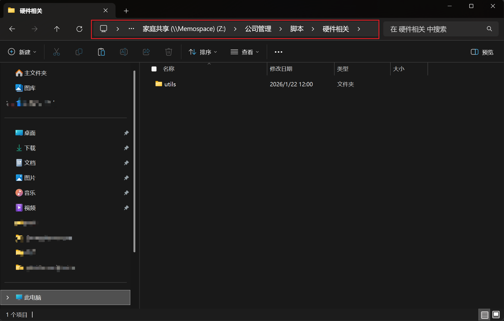
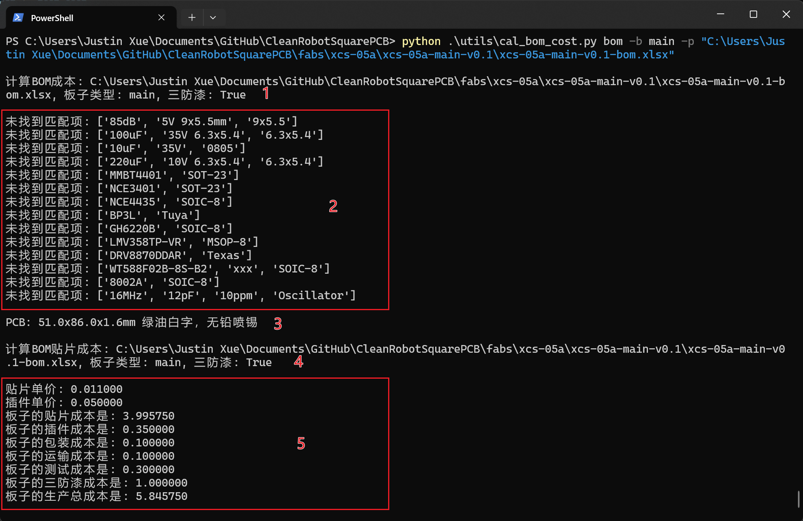

# 使用脚本计算BOM成本

作者@Justin

### 安装[Python](https://www.python.org/)依赖库

打开Windows终端，输入如下命令并回车

```
python -m pip install xlsxwriter
python -m pip install pymupdf
python -m pip install --upgrade pywin32
```

### 获取脚本

在圆形或者方形硬件仓库根目录下的`utils`子文件夹下。

如果没有这两个仓库权限，可以到公司共享文件夹获取，下载整个`utils`文件夹到本地。



### 在工程根目录执行如下脚本查看命令帮助

```
> python .\utils\cal_bom_cost.py -h
usage: cal_bom_cost.py [-h] {smt,bom} ...

计算BOM贴片成本

positional arguments:
  {smt,bom}   子命令
    smt       计算贴片成本
    bom       计算BOM成本

options:
  -h, --help  show this help message and exi
```

cal_bom_cost.py有两个子命令，分别是smt和bom。smt用于单独计算贴片成本；bom用于计算bom物料成本、pcb成本和贴片成本总和。

每个子命令的使用方法可以查看子命令的帮助：

```
python utils\cal_bom_cost.py 子命令 -h
```

例如：

```
> python .\utils\cal_bom_cost.py bom -h
usage: cal_bom_cost.py bom [-h] -b BOARD [-p] file

positional arguments:
  file                  原始BOM

options:
  -h, --help            show this help message and exit
  -b BOARD, --board BOARD
                        板子类型, 主板: main, 副板: sub
  -p, --proof           喷三防漆
```

### 使用举例

生成主板喷三防漆的成本

```
python .\utils\cal_bom_cost.py bom -b main -p xcs-05a-main-v0.1-bom.xlsx
```

log信息如下：

```
计算BOM成本: xcs-05a-main-v0.1-bom.xlsx, 板子类型: main, 三防漆: True

未找到匹配项: ['85dB', '5V 9x5.5mm', '9x5.5']
未找到匹配项: ['100uF', '35V 6.3x5.4', '6.3x5.4']
未找到匹配项: ['10uF', '35V', '0805']
未找到匹配项: ['220uF', '10V 6.3x5.4', '6.3x5.4']
未找到匹配项: ['MMBT4401', 'SOT-23']
未找到匹配项: ['NCE3401', 'SOT-23']
未找到匹配项: ['NCE4435', 'SOIC-8']
未找到匹配项: ['BP3L', 'Tuya']
未找到匹配项: ['GH6220B', 'SOIC-8']
未找到匹配项: ['LMV358TP-VR', 'MSOP-8']
未找到匹配项: ['DRV8870DDAR', 'Texas']
未找到匹配项: ['WT588F02B-8S-B2', 'xxx', 'SOIC-8']
未找到匹配项: ['8002A', 'SOIC-8']
未找到匹配项: ['16MHz', '12pF', '10ppm', 'Oscillator']

PCB: 51.0x86.0x1.6mm 绿油白字，无铅喷锡

计算BOM贴片成本: xcs-05a-main-v0.1-bom.xlsx, 板子类型: main, 三防漆: True

贴片单价: 0.011000
插件单价: 0.050000
板子的贴片成本是: 3.995750
板子的插件成本是: 0.350000
板子的包装成本是: 0.100000
板子的运输成本是: 0.100000
板子的测试成本是: 0.300000
板子的三防漆成本是: 1.000000
板子的生产总成本是: 5.845750
```



1. 指示开始计算BOM物料成本，注意板子类型和是否刷三防漆
2. 如果有未匹配到物料，这里会有显示，需要手动填写成本
3. 指示PCB尺寸信息，注意核对
4. 指示开始计算贴片成本
5. 贴片成本详情，注意核对

生成的成本BOM于原始BOM在同一目录，名字后缀增加`_cost`，如下：

```
xcs-05a-main-v0.1-bom.xlsx
xcs-05a-main-v0.1-bom_cost.xlsx
```