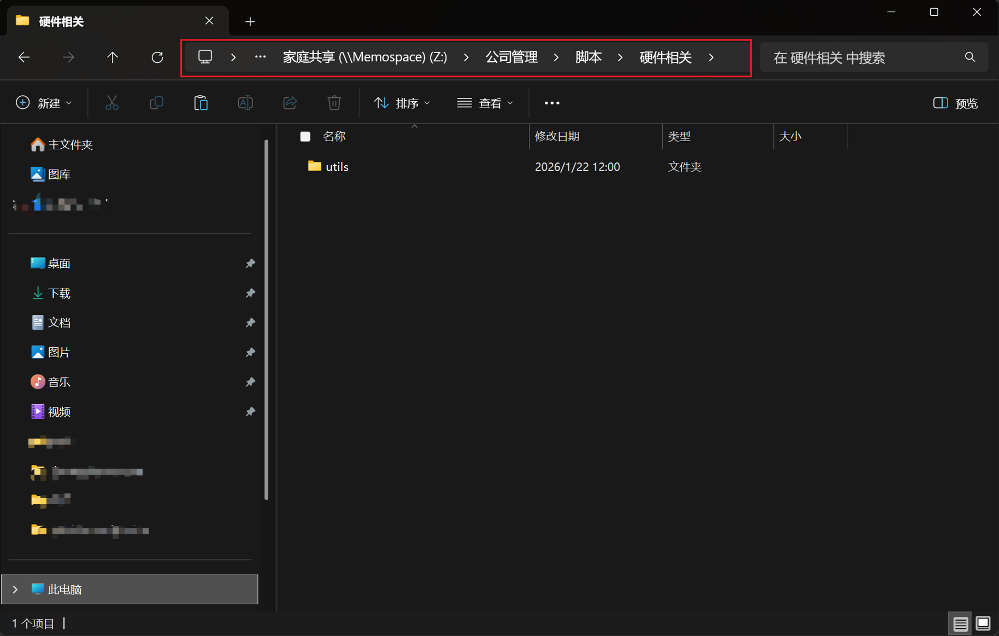
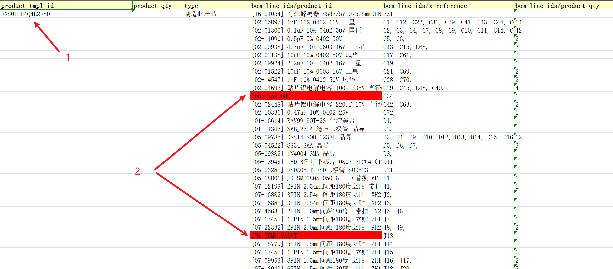
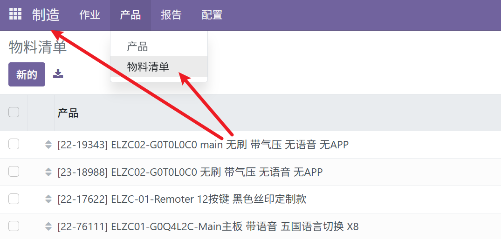
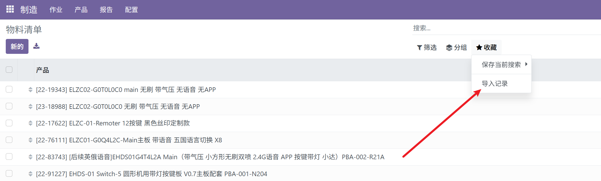
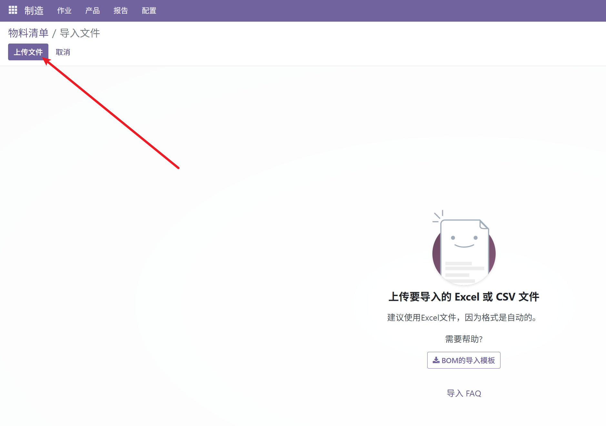
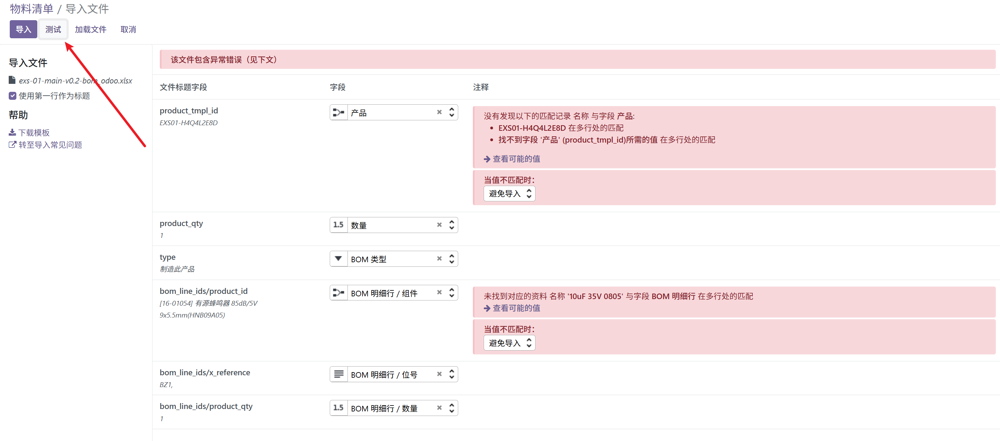
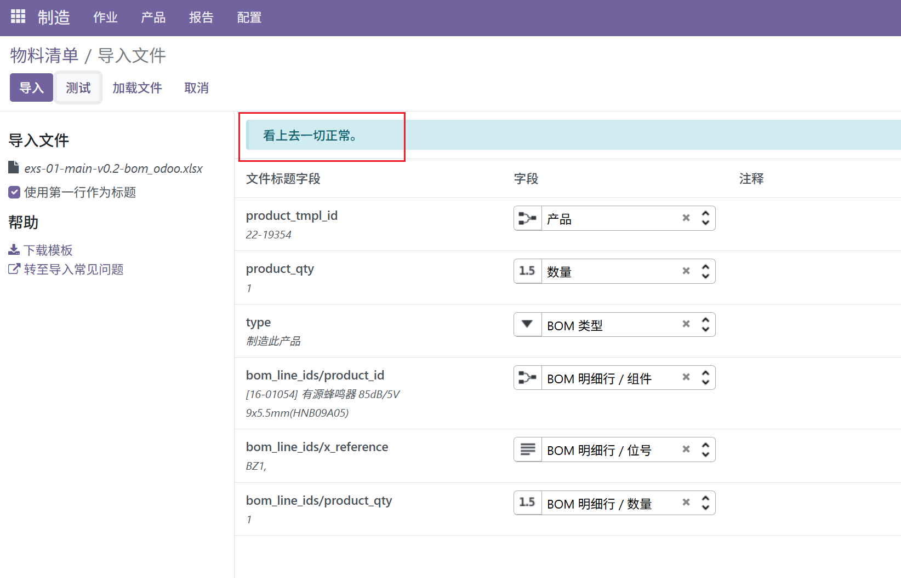
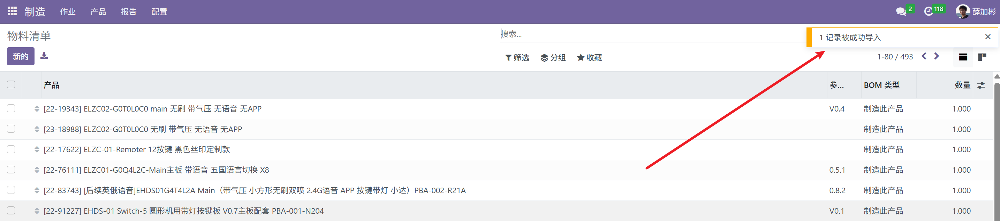

# 使用脚本转换原始BOM到odoo格式

作者@Justin

## 生成odoo BOM

### 安装[Python](https://www.python.org/)依赖库

打开Windows终端，输入如下命令并回车

```
python -m pip install xlsxwriter
python -m pip install pymupdf
python -m pip install --upgrade pywin32
```

### 获取脚本

在圆形或者方形硬件仓库根目录下的`utils`子文件夹下。

如果没有这两个仓库权限，可以到公司共享文件夹获取，下载整个`utils`文件夹到本地。



### 在工程根目录执行如下脚本查看命令帮助

```
> python .\utils\gen-odoo-bom.py -h
usage: gen-odoo-bom.py [-h] file

转换原始BOM为Odoo BOM

positional arguments:
  file        原始BOM

options:
  -h, --help  show this help message and exit
```

### 使用举例

```
python .\utils\gen-odoo-bom.py xcs-05a-main-v0.1-bom.xlsx
```

> 如果BOM里有多个sheet，需激活需要转换的sheet并保存，或者删除其他sheet只保留一个需要的。

log信息如下：

```
转为Odoo BOM 格式: C:\Users\Justin Xue\Documents\GitHub\CleanRobotSquarePCB\fabs\exs-01\exs-01-main-v0.2\exs-01-main-v0.2-bom.xlsx

未找到匹配项: ['10uF', '35V', '0805']
未找到匹配项: ['GN1.25MM', '9ASMT']
未找到匹配项: ['TYPE-C', '16P', 'CB1.6', '073', 'USB-C-SMD']
未找到匹配项: ['8002A', 'SOIC-8']
未找到匹配项: ['74HC165', 'TSSOP-16']
未找到匹配项: ['75.0x125.0x1.6mm', '绿油白字，无铅喷锡']
```

> 如果有未匹配到物料，这里会有显示，需要手动填写成本

生成的成本BOM于原始BOM在同一目录，名字后缀增加`_odoo`，如下：

```
xcs-05a-main-v0.1-bom.xlsx
xcs-05a-main-v0.1-bom_odoo.xlsx
```

## 检查BOM

生成BOM后打开对应excel文件检查是否有异常。



1. 上图1处单元格为BOM对应odoo产品的名称，名称格式为`[内部参照] + 产品名称`。如果还没有对应产品，则现需要先创建。
2. 2处红色背景的单元格是未匹配到odoo产品的物料，需手动匹配，并填写正确的odoo产品，名称格式为`[内部参照] + 产品名称`。
3. 注意贴片费用一行，贴片费用默认单价为1，乘以数量后为实际贴片费用，数量需要做对应修改。
4. PCB一般需要创建新的，创建好后填写名称到对应单元格。

## 导入BOM到odoo

### 进入制造模块，选择物料清单



### 点击收藏菜单下的导入记录选项，进入BOM导入界面



### 点击上传文件按钮，选择第一步生成的odoo格式BOM



### 导入文件后点击测试按钮

如果出现如下红色错误，定位到具体哪一列哪一行修改。修改完成后点击`测试`按钮右边的`加载文件`按钮重新加载BOM文件，然后点击测试。



如出现如下提示则表示BOM无异常。



### 点击导入按钮导入BOM到odoo系统

导入成功后会有如下提示：



### 导入后在odoo中打开BOM做相应检查

- 检查贴片成本
- 检查物料是否对应