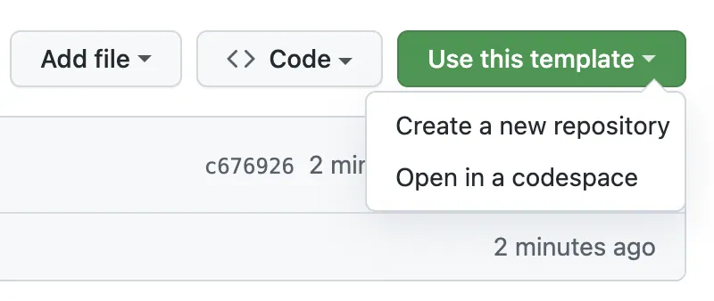

# 基于模板创建新的硬件项目仓库

## 模板仓库

[https://github.com/Timyerc/hardware-project-template](https://github.com/Timyerc/hardware-project-template)

## 新建仓库步骤如下

1. 在 GitHub 上，导航到模板仓库的主页。

2. 在文件列表上方，点击 **“Use this template”**（使用此模板）。
   

3. 选择 **“Create a new repository”**（创建一个新仓库）。

   > **注意**
   > 你也可以在 Codespace 中打开模板，之后再将你的工作发布为新的仓库。
   > 更多信息请参阅 *“Creating a codespace from a template”*。

4. 使用 **Owner** 下拉菜单，选择你希望拥有该仓库的账号（个人或组织）。
   

   默认选择Timyerc。

5. 输入仓库名称，以及可选的描述。
   

   硬件项目仓库名组成：项目名-pcb，字母全小写。

   如：odrive-pcb

6. 选择仓库的可见性（公开或私有）。

    默认选择私有。

7. 可选：如果你希望包含模板所有分支的文件结构，而不仅仅是默认分支，勾选 **Include all branches**。

8. 可选：如果你所在的个人账户或组织使用了 GitHub Marketplace 的某些 GitHub Apps，你可以在此选择要启用的应用。

9. 点击 **“Create repository from template”**（从模板创建仓库）。

## 新建硬件项目

在仓库根目录下新建一个项目子文件夹，目录结构如下：

```
./
├── .github/
│   ├── /workflows
|       ├── checkbom.yml
|       ├── drc.yml
│       └── fabs.yml
├── 项目名/
|   ├── 项目名.kicad_pro
│   ├── 项目名.kicad_sch
│   └── 项目名.kicad_pcb
├── docs/
│   ├── images/
│       └── use-this-template.png
├── utils/
│   └── ci.py
├── .gitignore
└── README.md
```