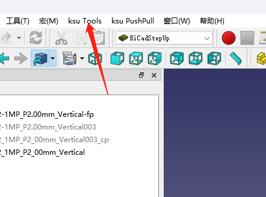

# 对应封装的3d添加
FreeCAD 下载
https://www.freecad.org/ 
KiCADSetup插件安装
https://github.com/easyw/kicadStepUpMod/ 
 
- 在FreeCAD中启动KiCadStepUp Workbench
- 导入需要添加3D模型的封装-loadfootprint
- 导入需要添加的3D模型-import 3d step
- 调出工具栏进行调整
- 选择3d模型进行调整,`不要选封装调整`[image](image-2.png)
- 选择3d模型重命名,并导出-export to kicad
