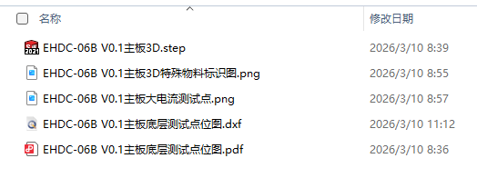
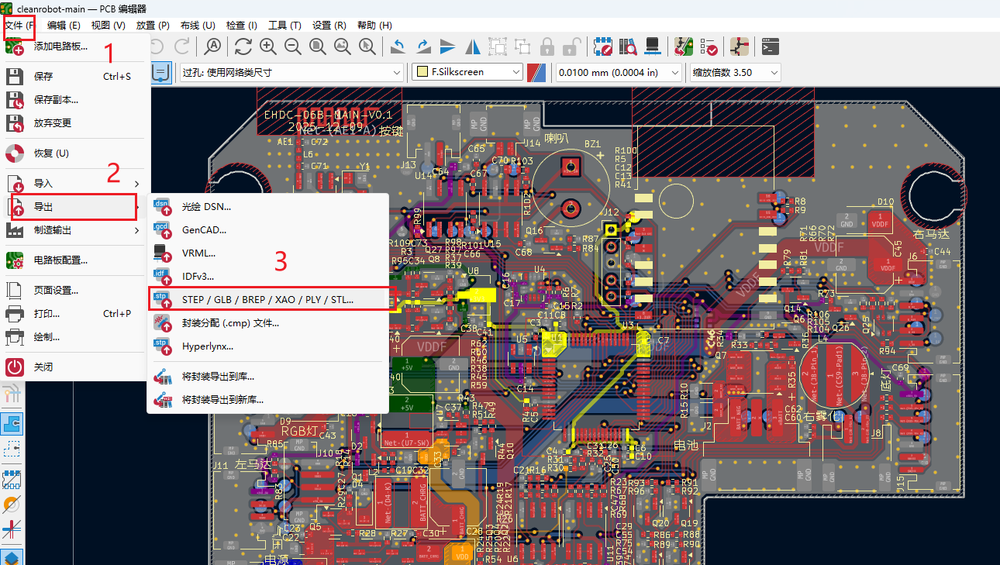
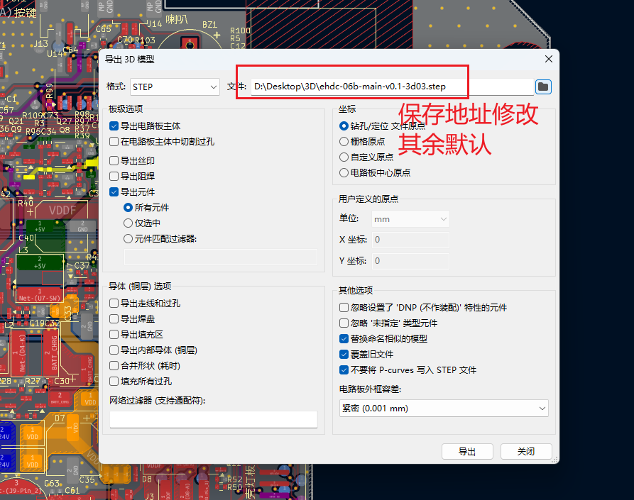
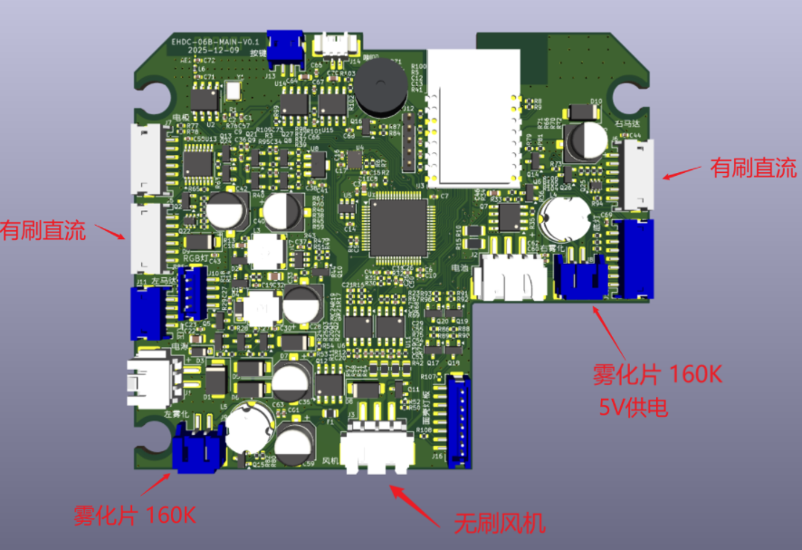
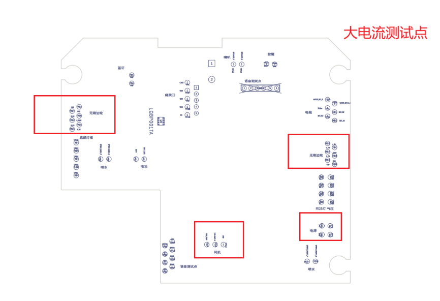
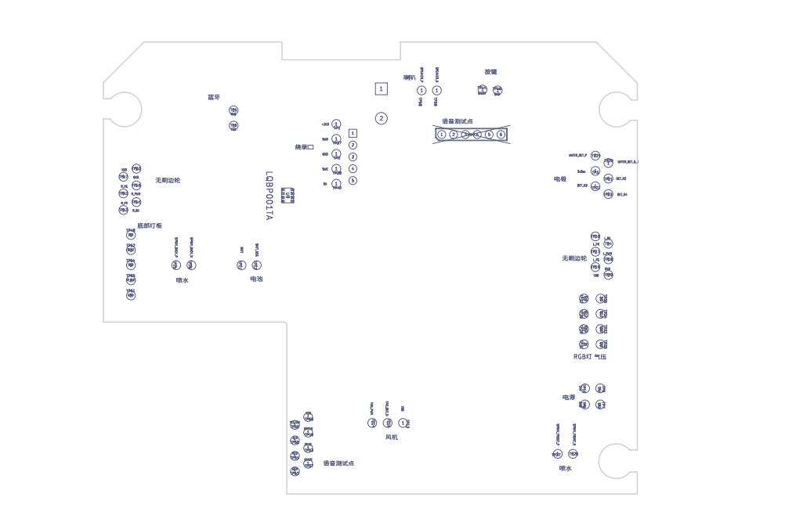
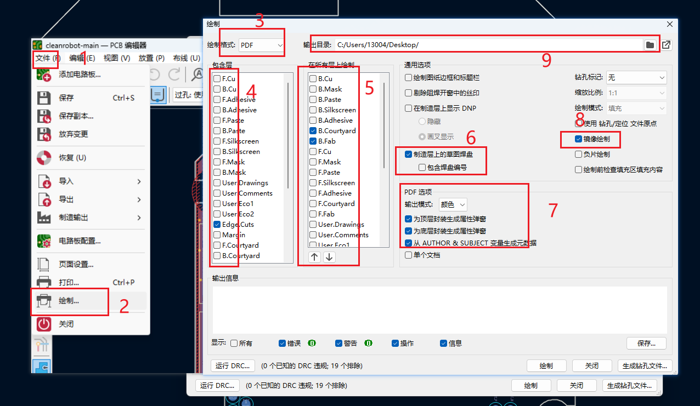
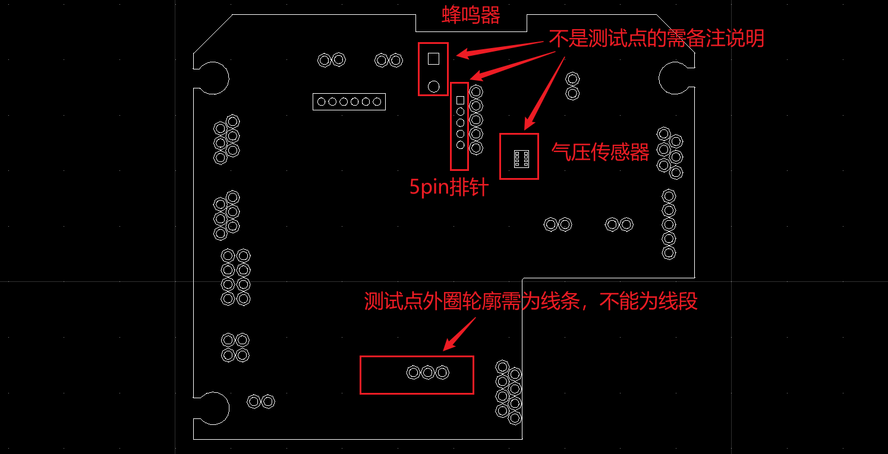
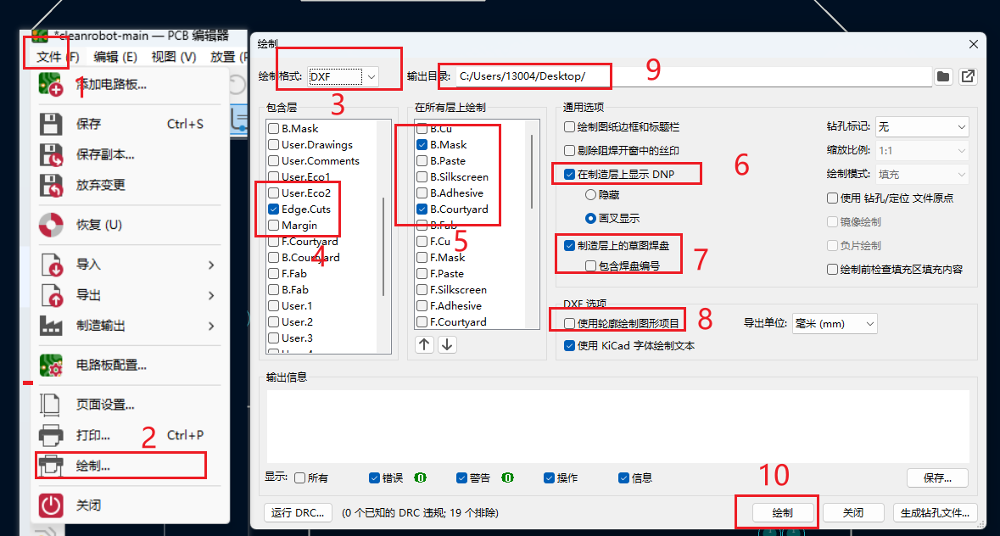

# 测试治具文档模板

## 输出所需资料

1.生产板框测试点、大电流测试需要标识提示

2.主板3D

3.生产的主板喷水方式有水泵、电磁阀、雾化片、数量、电压、频率规格需要标识提示

4.要生产的是吸附风机有刷无刷电机、边轮有刷无刷电机标识提示

5.底层测试点加板框的dxf

## 3D文件输出

## 特殊物料标识图

## 大电流测试点

大电流测试点位置框选可以从测试点位图PDF中截取。

## 底层测试点位图PDF格式

在包含层中只选择板框层

## 底层测试点位图DXF格式

在包含层中只选择板框层

