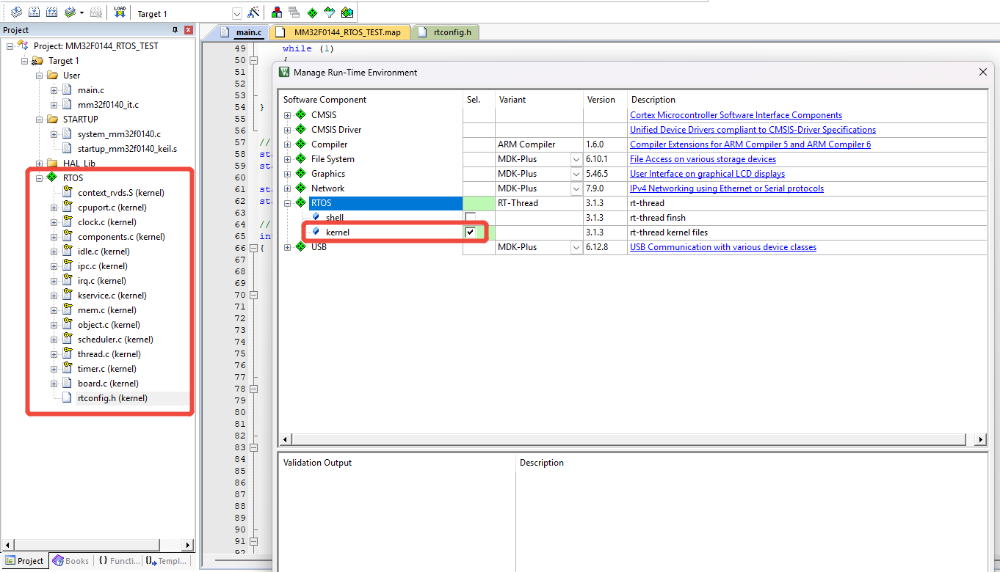
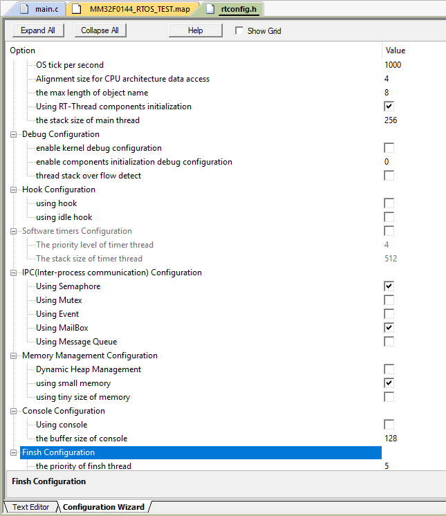
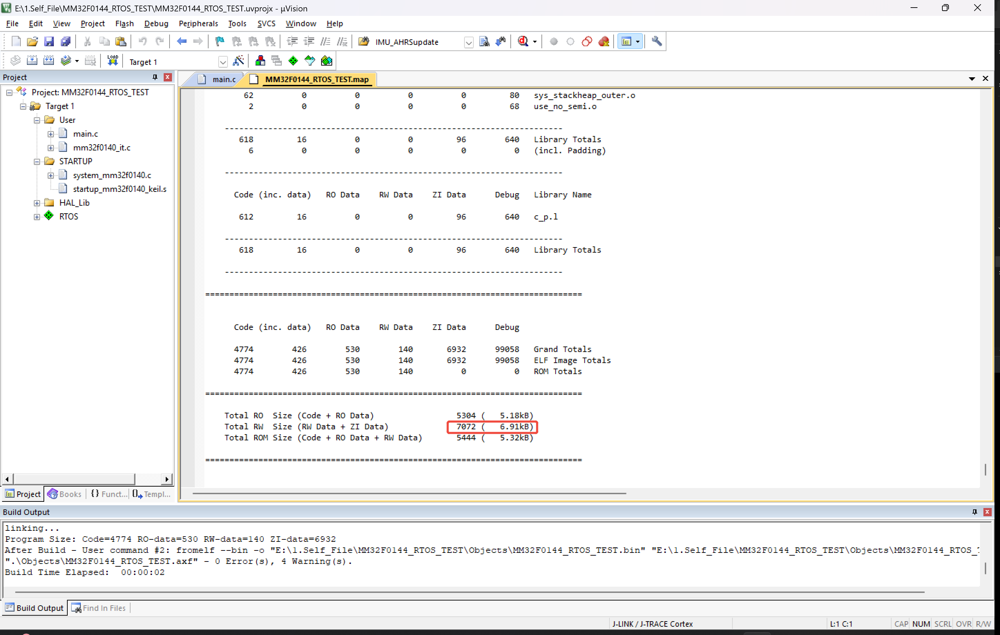
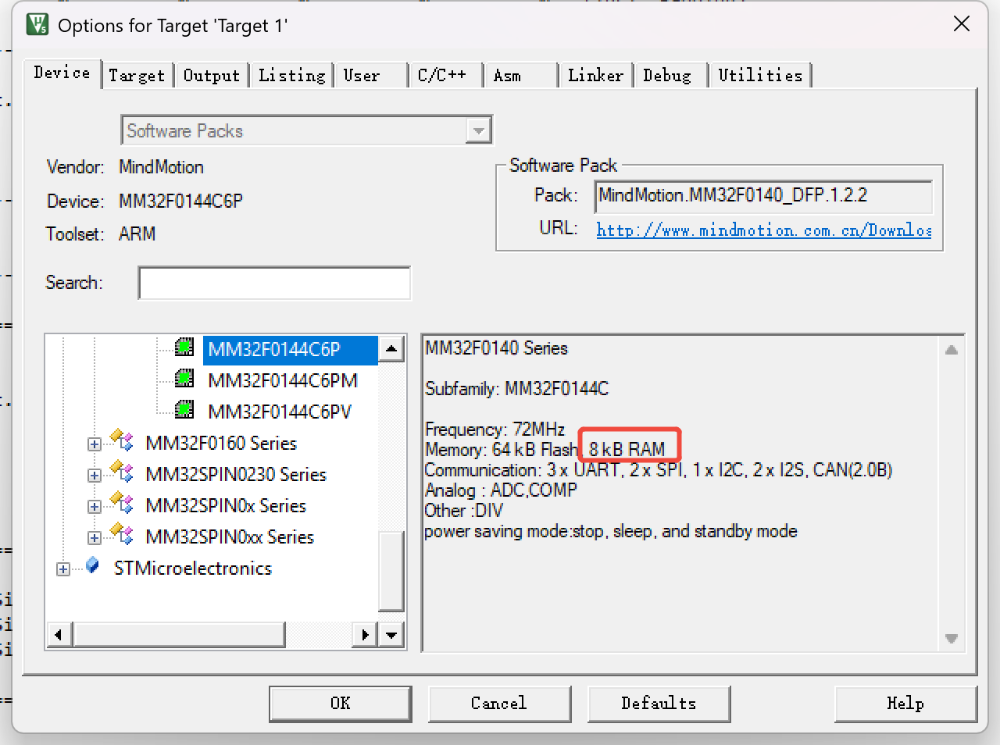
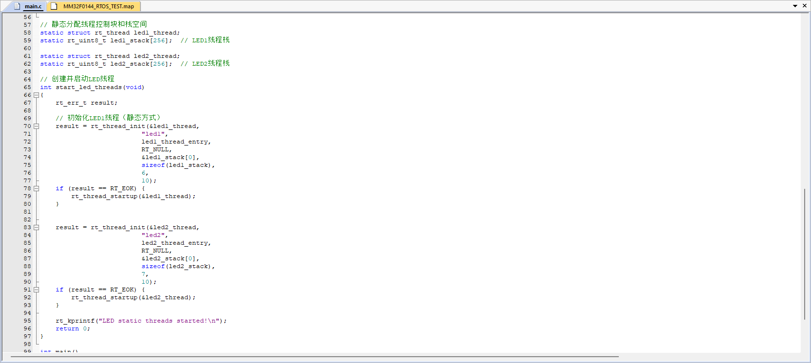
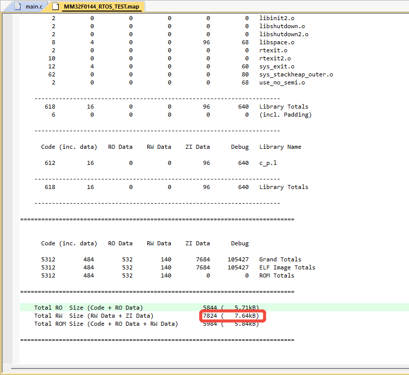

# 在资源有限的M0单片机上运行RTOS

**@YUTONG 2025/11/08**
## 1.添加RTOS内核至工程中  

## 2.配置RTOS，裁剪内核文件

## 3.编译工程,查看内核占用内存大小。

- RO (Read Only)： 只读数据。包括程序代码（Code）和常量（如 const 声明的变量）。
- RW (Read Write)： 读写数据。指已初始化的全局变量和静态变量。
- ZI (Zero Initialized)： 零初始化数据。指未初始化或显式初始化为0的全局变量和静态变量。
- ROM (Read Only Memory)： 程序存储器的总占用大小，即需要烧录到Flash中的内容。
- RAM (Random Access Memory)： 运行时的内存占用大小。  
### 3.1.Total RO Size (Code + RO Data) = 5304 (5.18kB)
>**含义**：程序代码和所有常量总共占用了5304 字节。
>**存储位置**：这部分数据存储在单片机的Flash（程序存储器）中。
### 3.2.Total RW Size (RW Data + ZI Data) = 7072 (6.91kB)
>**含义**： 你的程序在运行时，需要占用的 RAM 总量 为 7072 字节。
>**构成**：
>- RW Data： 已初始化的全局/静态变量。这些变量的初始值需要从Flash中拷贝到RAM。
>- ZI Data： 未初始化的全局/静态变量。系统启动时会在RAM中为它们开辟空间并清零。
### 3.3.Total ROM Size (Code + RO Data + RW Data) = 5444 (5.32kB)
>**含义**： 需要烧录到单片机 Flash 中的总数据量是 5444 字节。
>**构成**： 它等于 RO Size + RW Data的初始值。
>- Code + RO Data (5304字节) 直接存放在Flash中。
>- RW Data的初始值（5444 - 5304 = 140字节）也存放在Flash中。当程序启动时，系统会把这140字节的初始值从Flash拷贝到RAM中对应的RW区域。
>- 分析： 这个值（5.32kB）通常略大于 RO Size (5.18kB)，因为它包含了RW变量的初始值。它决定了程序对Flash空间的实际占用量。  
## 4.速览MCU资源情况
  
从上图可以看出，单片机MM32F0144C6P的RAM空间最大为8KB，Flash空间最大为64K。M0的MM32单片机引入RTOS内核后，RAM空间已经占用了6.91KB，Flash空间占用5.32KB。  
## 5.运行两个任务
 
### 5.1.编译运行，查看map文件
  
从图中可以看出，添加两个任务后RAM空间为7.64KB，Flash空间为5.84KB。RAM只剩下了0.36KB了，资源耗尽了，无法继续添加任务了。  
## 6.总结  
在资源受限的M0单片机上也可以运行RTOS，但是其资源有限，没有必要在M0单片机上运行RTOS。

