# OTA升级固件处理

## OTA脚本环境搭建

1、进入python官网，下载最新python，安装

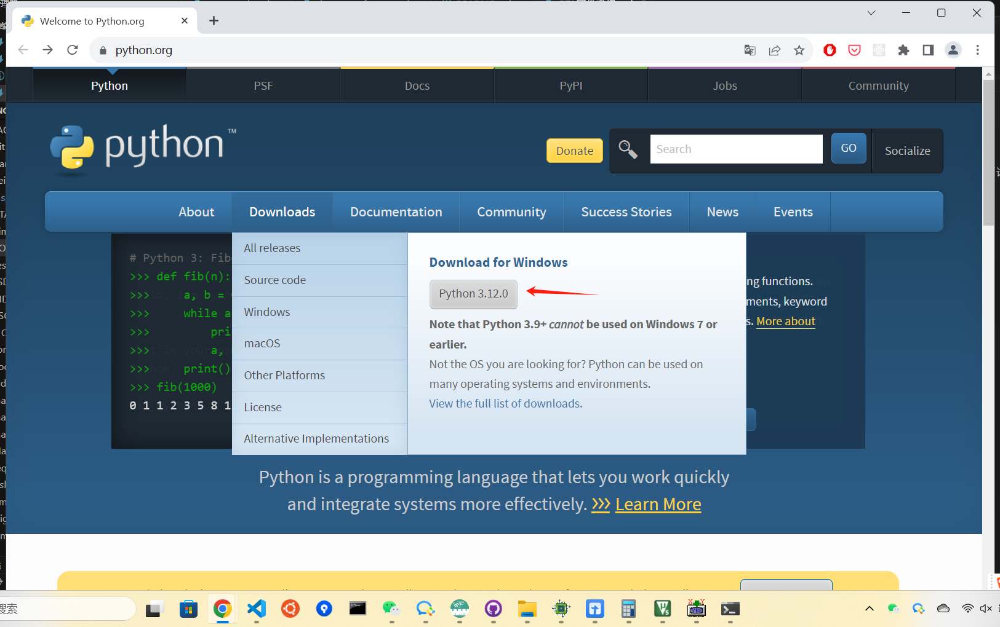

2、打开终端，运行指令
```
python -m pip install cryptography
```
3、若出现安装不成功，运行指令
```
python -m pip install --upgrade setuptools
```
4、继续运行指令
```
python -m pip install pycryptodome
```

## OTA固件生成

***注意：如果主板芯片是HK32的，主板程序需要用烧录器烧录进去再测试。***

1、先根据项目找到下图中1处的target.h文件，打开文件找到2处的MCU_VER和 MCU_APP_VER_NUM ，修改其版本号，两个值需要保持一致（版本号需要比测试机器中程序版本高）。

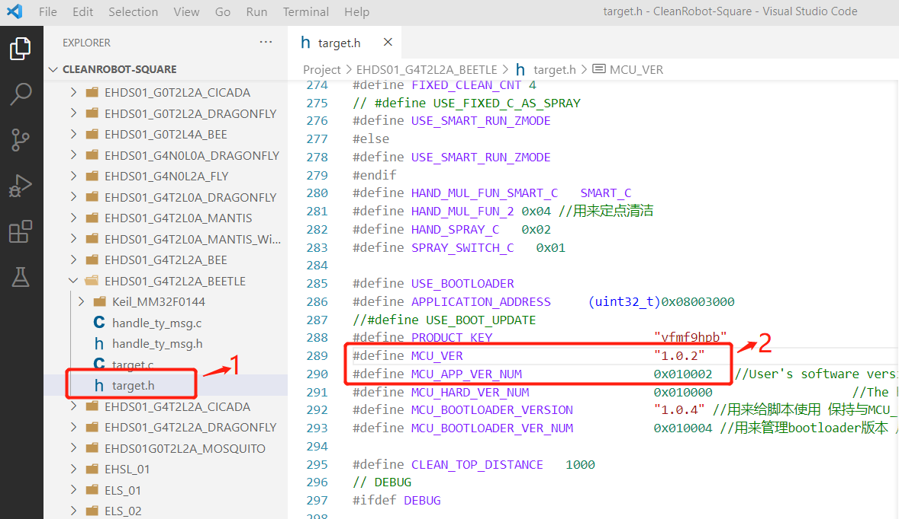

2、根据下图中1处的路径双击打开图中2处的文件进行编译。


注意编译设置如下图：


3、编译后，在output文件里夹会生成一个xxx_merge_v版本号_Release.hex的文件，如下图：

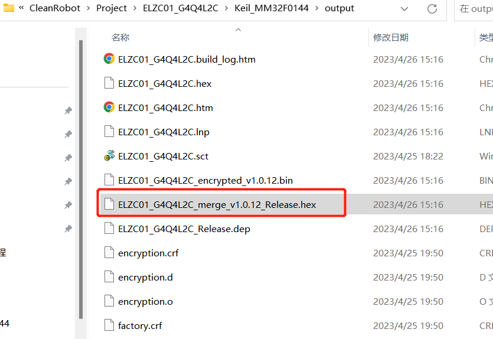

4、然后进入项目下的utils目录打开终端执行如下图所示命令（**test**为内部测试用，正式发布用**Release**）。

其中ELZC01_G4Q4L2C为项目名称，紧跟在后面的是版本号


执行成功后显示如下：


5、然后打开项目下的utils文件夹，会发现生成如下图文件，将这个文件上传到涂鸦平台。


## 涂鸦平台上传OTA固件步骤

### 新增自定义固件

1、登录涂鸦平台后，左侧目录选 **产品->产品开发** ，然后通过中间的搜索框查找对应的产品，如下图所示

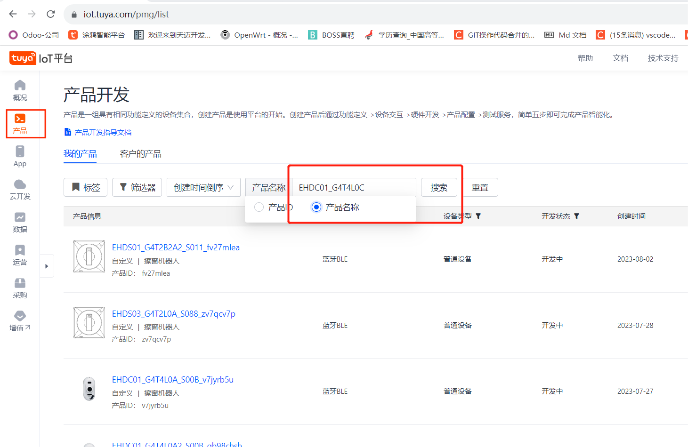

2、找到对应的产品后，单击产品名称进入

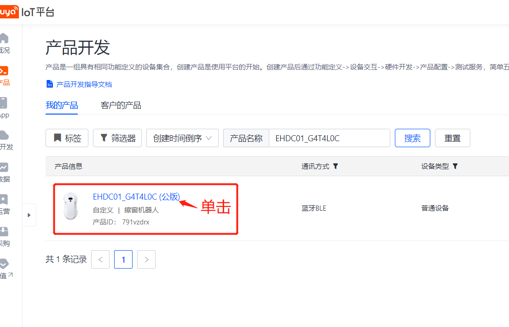    

3、点击**进入开发流程**

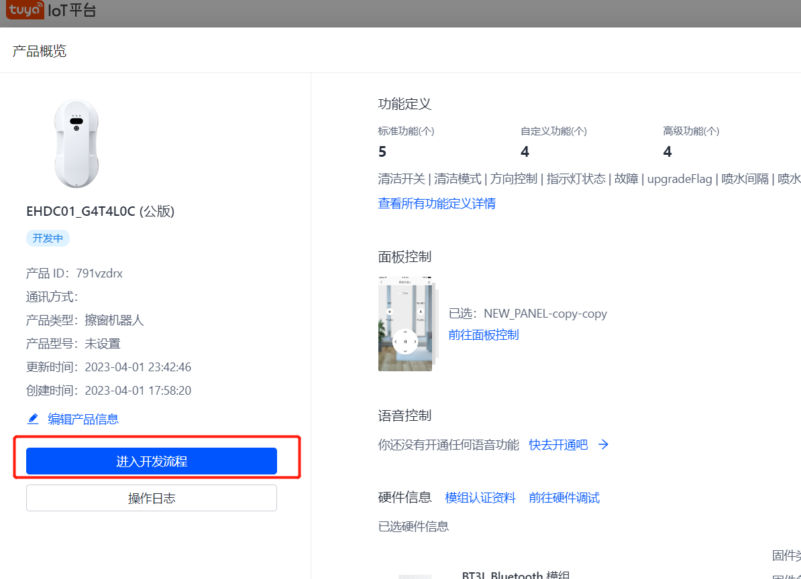 

4、点击页面中的**硬件开发**

 

5、先查看页面下方是否存在自定义固件

若存在，如下图所示:

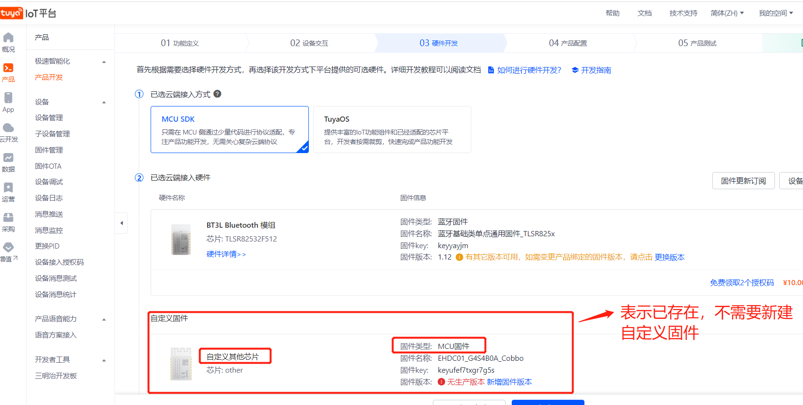 

若没有，如下图所示:

 

6、填写**固件标识名、固件名称、固件类型、固件大小**，注意名称的一致性，然后点击右下角的**生成固件Key**，如下图所示:

 

### 新建版本

1、选择右侧的目录**产品->固件管理**，然后将涂鸦pid复制过来进行搜索，如下图所示：

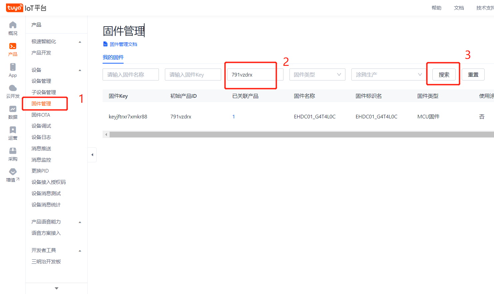 

> *涂鸦pid在target.h中，如下图所示：*

> 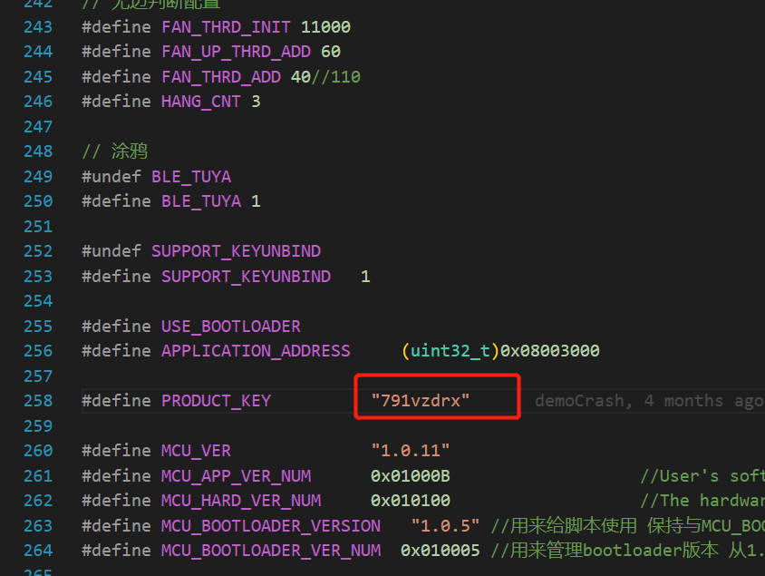 

2、点击**新建版本**，如下图所示：

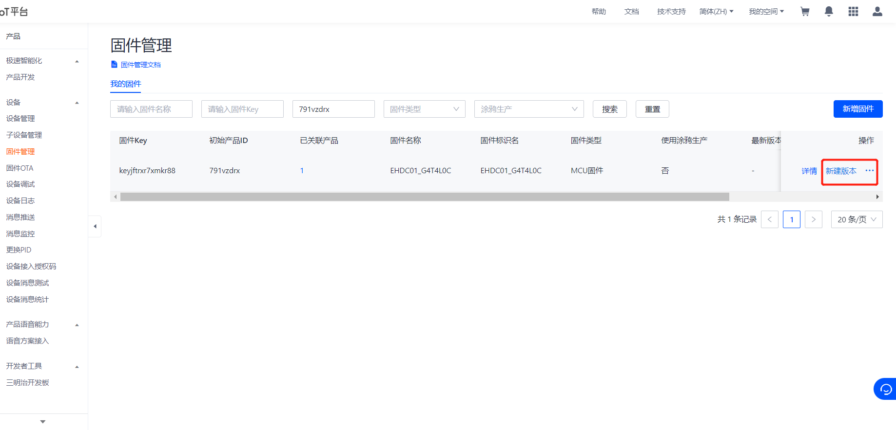 

3、填写固件版本、上传固件，保持版本一致，然后点击右下角的**保存并上架**按钮，最后点击确认上架，如下图所示：

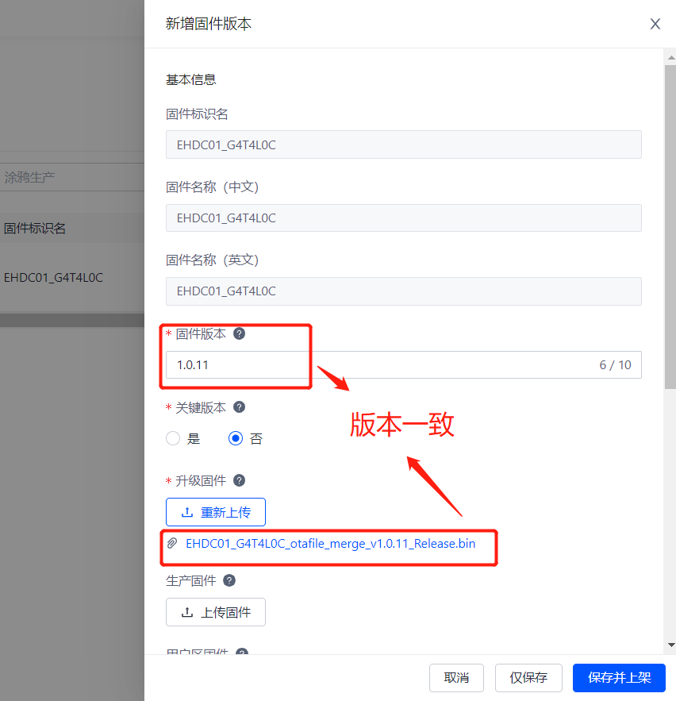 

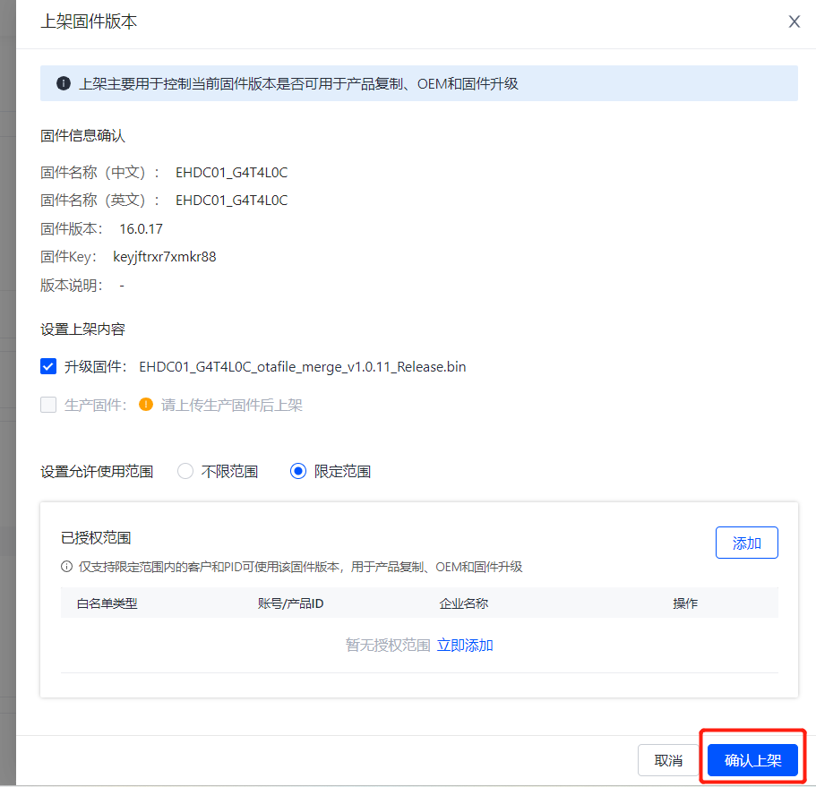 

### 新建固件升级

1、选择右侧的目录**产品->固件OTA**，选择对应的固件，然后点击**新建固件升级**按钮，如下图所示：

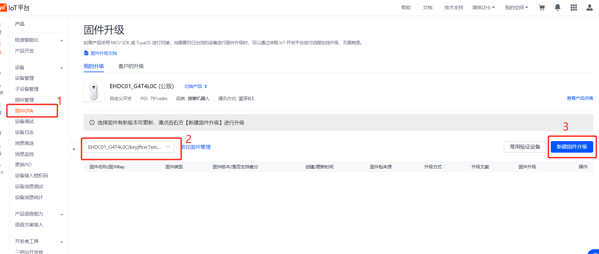 

2、选择升级的**固件版本、升级方式**，然后点击**确定**，如下图所示：

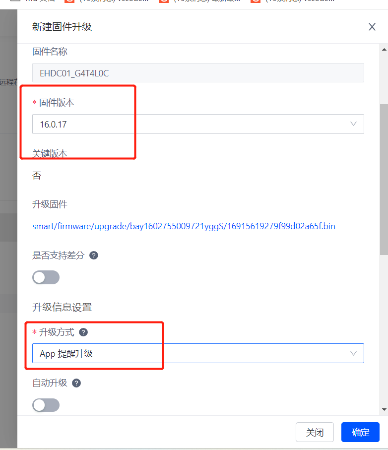 

### 验证固件升级

1、选择右侧的目录**产品->固件OTA**，选择对应的固件，然后点固件中的**验证**按钮

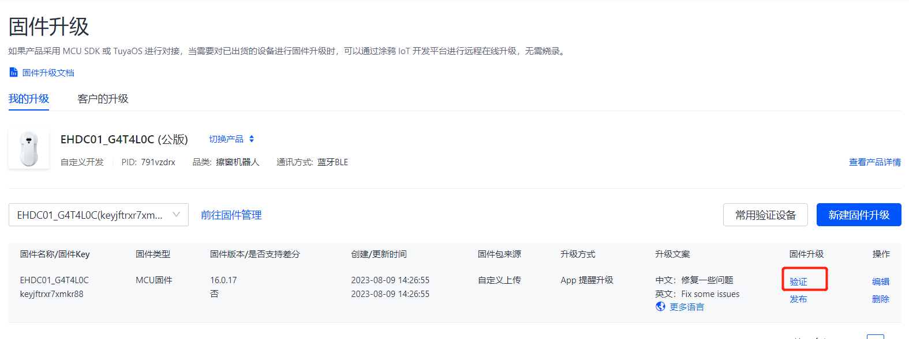 

2、进入测试设备验证页面，然后点击**通过设备号直接添加**添加手机**智能生活app**中对应的设备号id，添加成功后即可进行固件升级测试，如下图所示：

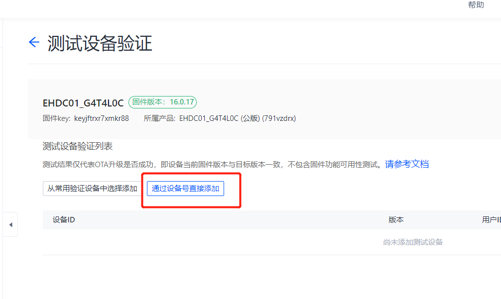 

APP上获取设备id的方法如下图所示：

 


