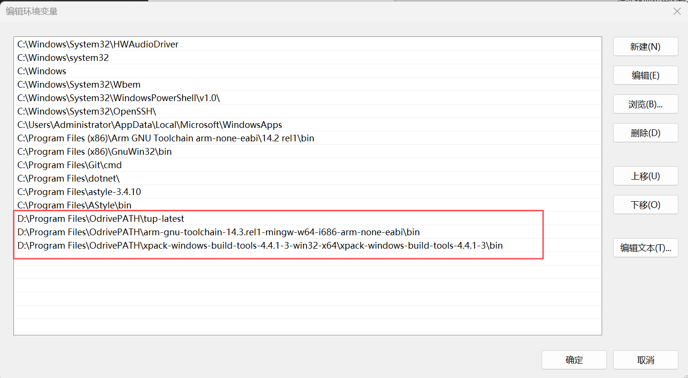
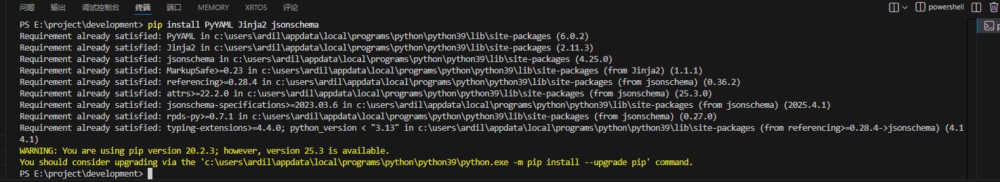
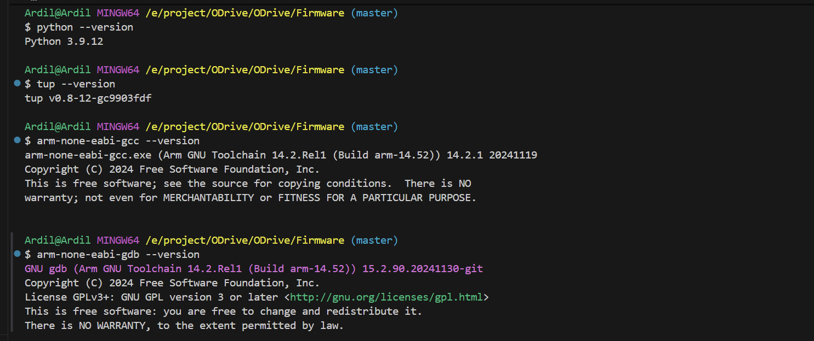
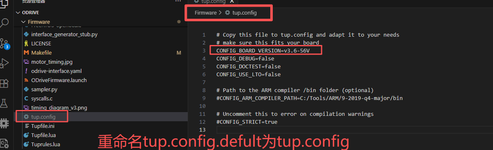
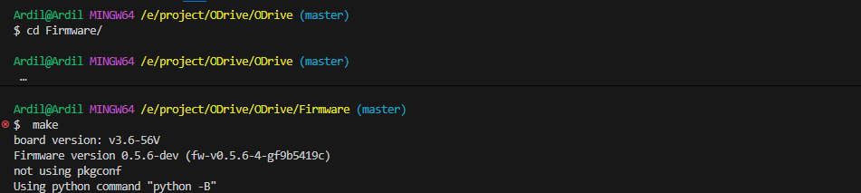
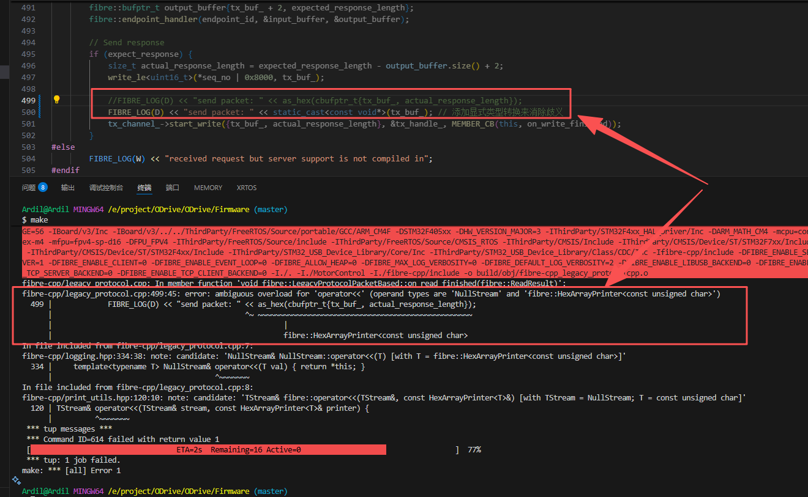
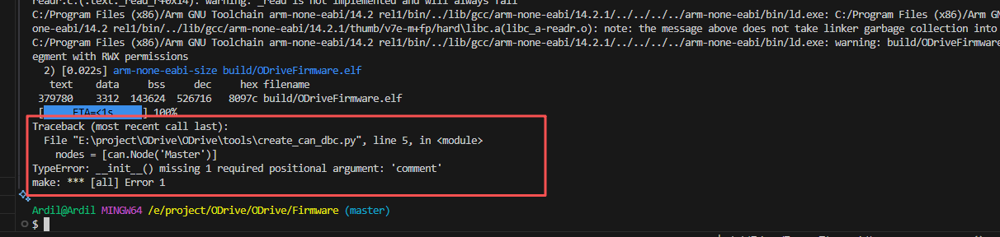
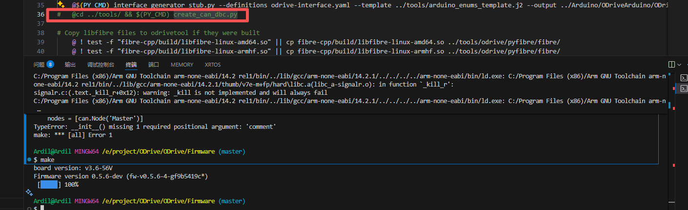

# ODrive源码编译配置过程

## 环境搭建

1、安装Git，下载地址：[Git](https://git-scm.com/)

2、安装VS Code，下载地址：[Visual Studio Code - The open source AI code editor](https://code.visualstudio.com/)

3、安装Python 3.9.12，下载地址：[Download Python | Python.org](https://www.python.org/downloads/)

4、获取Tup v0.8.12，下载地址：[tup | Home](https://gittup.org/tup/index.html)

5、获取GUN MCU Eclipse，下载地址：[Verify two-factor authentication](https://github.com/xpack-dev-tools/windows-build-tools-xpack/releases)

6、获取GNU ARM Embedded Toolchain，下载地址：[Downloads | GNU Arm Embedded Toolchain Downloads – Arm Developer](https://developer.arm.com/downloads/-/gnu-rm)

## 添加环境变量

1、将获取到的tup、GUN MCU Eclipse、GNU ARM Embedded Toolchain解压并放到一个英文路径下。


2、将bin目录添加到环境变量，并重启电脑



## 环境测试

1、新建终端，并打开Git Bash终端


2、添加Python支持库

```
pip install PyYAML Jinja2 jsonschema
```

3、 测试环境变量是否生效

```
$ arm-none-eabi-gcc --version
$ arm-none-eabi-gdb --version
$ tup --version                 # should be 0.8.12 or later
$ python --version              # should be 3.9 1or later
```



# 克隆ODrive的官方源码

Odrive源码GitHub地址：[Verify two-factor authentication](https://github.com/odriverobotics/ODrive)

1、依据Odrive开发板版本，配置tup.config



2、编译源码

```
$cd Firmware/
$make
```



3、错误处理
编译如果停在如下进度将legacy_protocol.cpp第499行修改为：

```
FIBRE_LOG(D) << "send packet: " << static_cast<const void*>(tx_buf_); 
```

添加显式类型转换来消除歧义


再次编译，便可生成固件，但是python会提示comment命令不支持，create_can_dbc.py
这个文件可能有多种关键字都不支持，这源于版本的不同，但不影响固件的生成
在MakeFile注释掉对create_can_dbc.py的处理，再重新编译一次即可



完成编译


