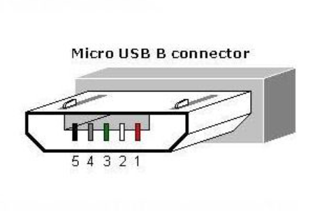
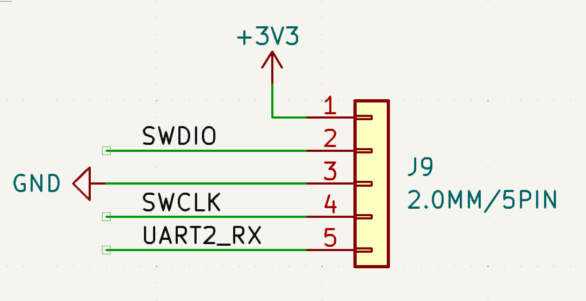
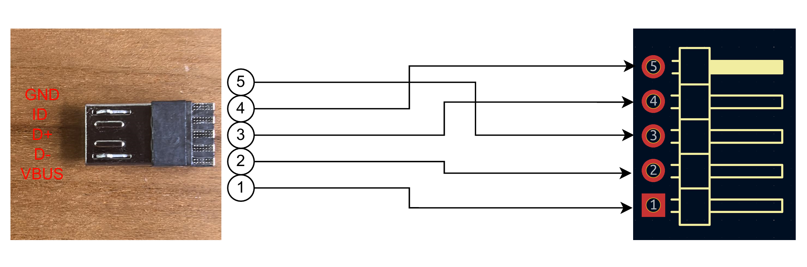

# Micro USB烧录口引脚定义

@Justin

## 🔌 Micro USB 5-Pin 插头引脚定义（从左至右，插口正面朝你）

| 引脚编号 | 名称   | 功能说明       | 常见颜色             |
| ---- | ---- | ---------- | ---------------- |
| 1    | VBUS | +5V 电源     | 红色               |
| 2    | D−   | 数据线负       | 白色               |
| 3    | D+   | 数据线正       | 绿色               |
| 4    | ID   | OTG识别（主/从） | 无连接（充电线）或接地（OTG） |
| 5    | GND  | 地          | 黑色               |

## 我们标准烧录调试口引脚定义

| 引脚编号 | 名称     | 功能说明       |
| ------- | -------- | -------------  |
| 1       | 3V3      | 3.3V 电源      |
| 2       | SWDIO    | 数据线         |
| 3       | GND      | 地             |
| 4       | SWCLK    | 时钟线/串口发送 |
| 5       | UART2_RX | 串口接收        |

## 排针与Micro USB插头接线顺序

| Micro引脚编号 | 名称 | 排针引脚编号 | 名称 |
| ---- | ---- | ----- | ---------- |
| 1    | VBUS | 1     | 3V3        |
| 2    | D−   | 2     | SWDIO      |
| 3    | D+   | 4     | SWCLK      |
| 4    | ID   | 5     | USART2_RX  |
| 5    | GND  | 3     | GND        |

