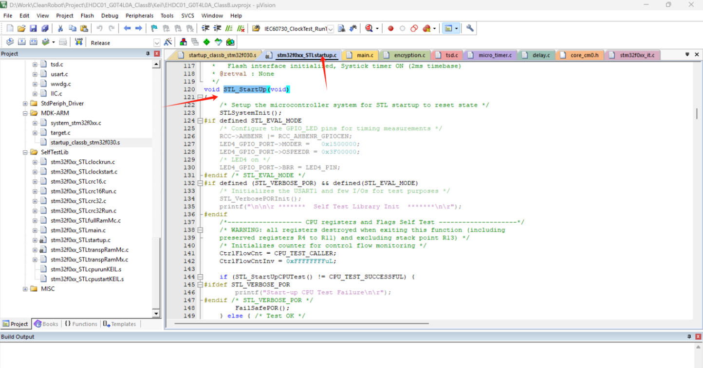
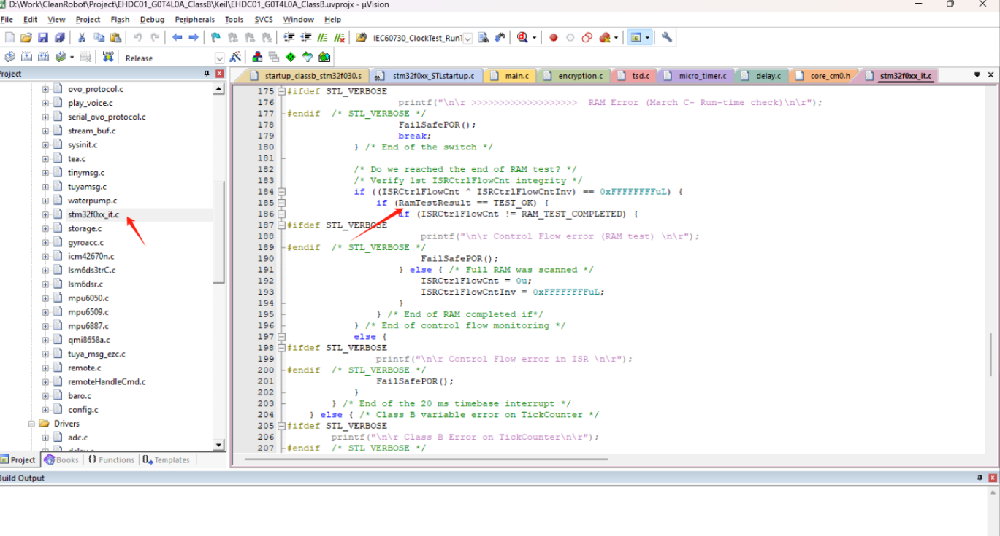
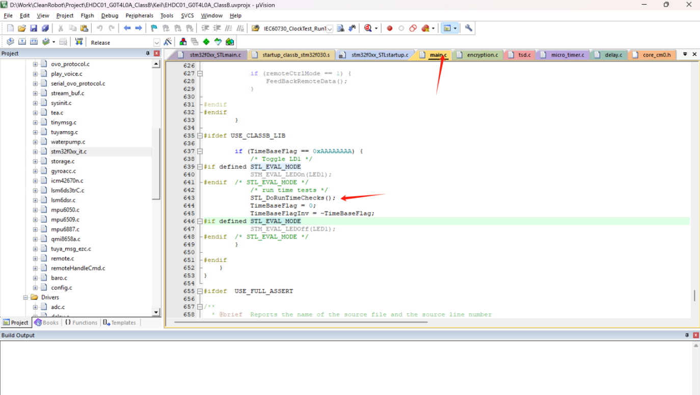

# STM32 SGS认证程序测试流程

## 测试stm32f0xx_STLstartup.c文件中的STL_StartUp函数是否完整执行完，并且没有进入FailSafePOR函数

## 测试在stm32f0xx_it.c文件中的全区ram检测必须调试到RamTestResult为TEST_OK，ram检测为每一次检测4个字节。所以调试需要一段时间才能检测完整ram。

## 测试main.c 文件中的STL_DoRunTimeChecks其他周期性检测函数，需要这个函数执行成功，不能进入FailSafePOR函数

