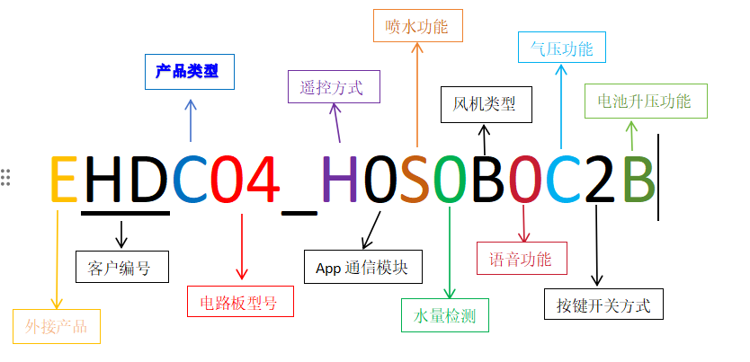
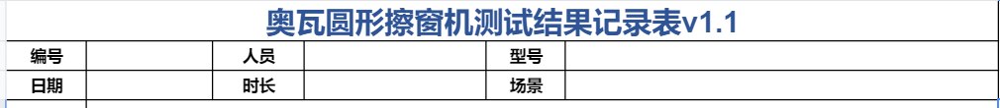
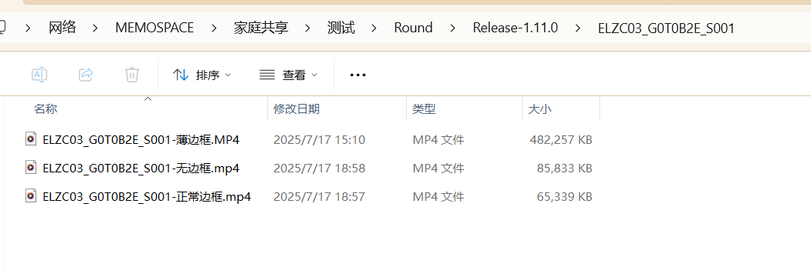

# 擦窗机整机测试

## 一、打印测试表格

测试表打印地址：点击链接加入微盘共享空间【公共文件】https://drive.weixin.qq.com/s?k=ACQAJgc_AAcIPyq1KF

## 二、理清软件有哪些功能以及对应的样机是哪个

例如：EHDC04_H0S0B0C2B对应功能如下 

具体功能定义可参考：点击链接加入微盘共享空间【公共文件】https://drive.weixin.qq.com/s?k=ACQAJgc_AAcIPyq1KF 的**外接擦窗机PCBA编码**文件

## 三、正式进行整机测试

### 1、填写测试记录表表头信息

测试编号：是指软件编码，可查看点击链接加入微盘共享空间【公共文件】https://drive.weixin.qq.com/s?k=ACQAJgc_AAcIPyq1KF 中的**软件功能对照表**

测试人员：点击链接加入微盘共享空间【公共文件】https://drive.weixin.qq.com/s?k=ACQAJgc_AAcIPyq1KF 中的**测试人员编号**文件

测试型号：填写软件名就可以
 
测试场景：正常边框玻璃、无边框玻璃、薄边框玻璃(圆形机)、深边框玻璃（方形机）。

### 2、根据表格的内容一项项测试，没有的功能可划掉
    
**注意：有些功能不是所有机器都有，比如：定点清洁、回原点、app、语音等等。**

从测试开始到结束需要录制相关的视频，测试完成后将视频上传到共享盘：\\\\Memospace\家庭共享\测试\Round

例如：

