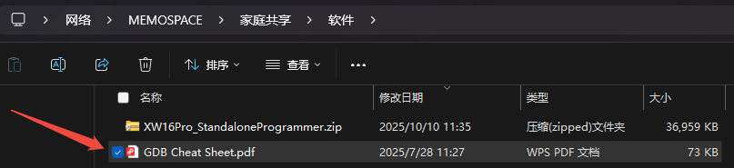
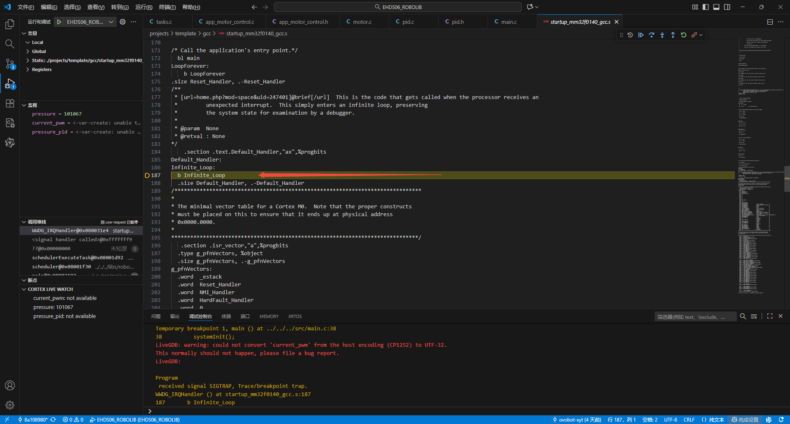
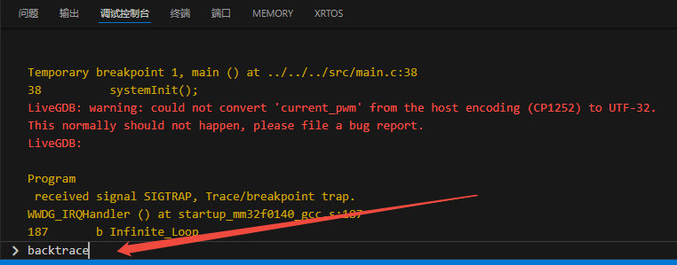
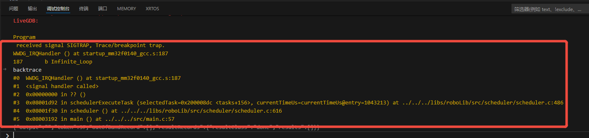
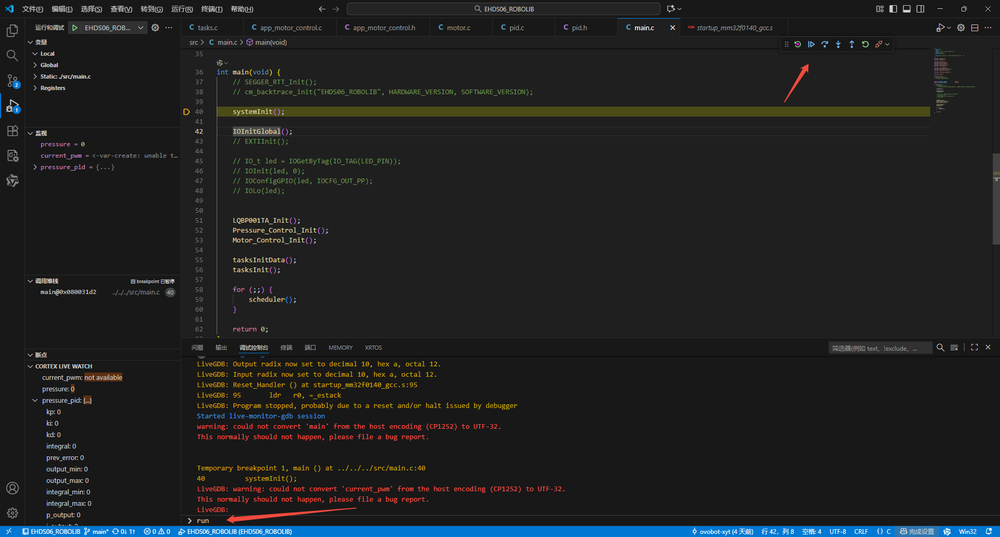
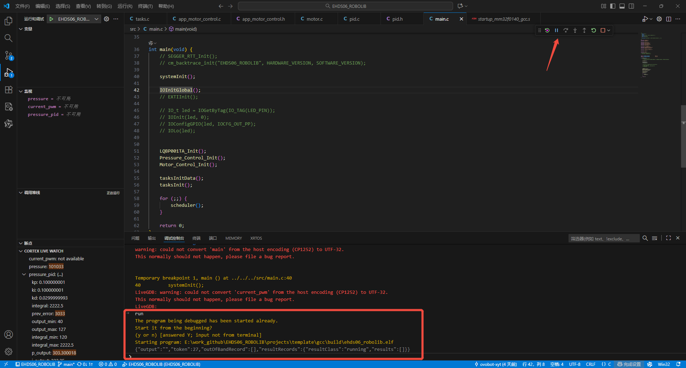

# VSCode使用GDB命令调试MCU

**@YUTONG 2025/10/31**
***
## 1. GDB是什么？
>GDB 全称“GNU symbolic debugger”，从名称上不难看出，它诞生于 GNU 计划（同时诞生的还有 GCC、Emacs 等），是 Linux 下常用的程序调试器。发展至今，GDB 已经迭代了诸多个版本，当下的 GDB 支持调试多种编程语言编写的程序，包括 C、C++、Go、Objective-C、OpenCL、Ada等。实际场景中，GDB 更常用来调试 C 和 C++程序。  
***  

## 2. GDB可以用来做什么？
>1. GDB 可以用来查看程序运行时数据，比如变量的值、内存地址、函数调用栈。  
>1. GDB 可以查看程序运行时内存使用情况，比如内存使用情况、内存泄漏情况。
>1. GDB 可以查看程序运行时文件系统情况，比如文件打开情况、文件描述符情况。  
>1. GDB 可以查看程序运行时网络情况，比如网络连接情况、网络传输情况。  
>1. GDB 可以查看程序运行时进程情况，比如进程状态、进程调度情况。  
>1. GDB 可以用来查看程序运行时系统调用情况，比如系统调用参数、系统调用返回值。  
>1. GDB 可以用来查看程序运行时信号情况，比如信号发生情况、信号处理情况。    
>1. GDB 可以用来查看程序运行时配置信息，比如配置信息、环境变量信息**等等**。  
***
## 3. GDB调试命令  
详细的GDB命令参考文档：https://sourceware.org/gdb/current/onlinedocs/gdb/ 或者在共享文件的软件文件夹下浏览《GDB CheatSheet.pdf》文档。  

### 3.1 GDB常用的命令  
>1. **break**：设置断点，可以设置多个断点。  
>1. **clear**：清除断点，可以清除多个断点。  
>1. **continue**：继续执行程序，直到下一个断点。  
>1. **finish**：执行当前函数，直到返回。  
>1. **list**：查看当前代码。  
>1. **next**：执行下一行代码，如果下一行代码是函数调用，则执行函数调用。  
>1. **step**：执行下一行代码，如果下一行代码是函数调用，则执行函数调用，并进入函数。  
>1. **print**：打印变量的值。  
>1. **quit**：退出调试器。  
>1. **run**：运行程序。  
>1. **set**：设置参数。  
>1. **show**：查看参数。  
>1. **where**：查看当前函数调用栈。  
>1. **help**：查看帮助。  
>1. **watch**：监控变量，当变量值改变时，会触发断点。
>1. **backtrace**：查看当前函数调用栈。  
***
## 4. GDB调试示例  
- **backtrace**命令  
  1. 调试程序，当程序运行到某个函数时，可以通过**backtrace**命令查看当前函数调用栈。  
  2. 同样的，当程序跑飞时，也可以通过**backtrace**命令查看当前函数调用栈。
  3. 示例：  
  
如图所示，在调试时发现程序进入了Default_Handler，程序跑飞。  
  4. 通过**backtrace**命令查看当前函数调用栈
  
  5. 调试控制台输出的调用栈如下：
   
   栈是压栈顺序，从图中的backtrace输出信息可以看出，程序是执行schedulerExecuteTask函数时传入了0地址最终导致触发了 WWDG_IRQHandler进入了Infinite_Loop。  
- **run**命令  
   1. 准备调试程序，通过**run**命令运行程序。
   2. 示例：
   
   3. 调试控制台输出如下：
  
可以看到程序开始运行了。  