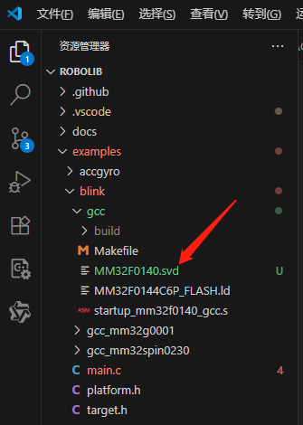
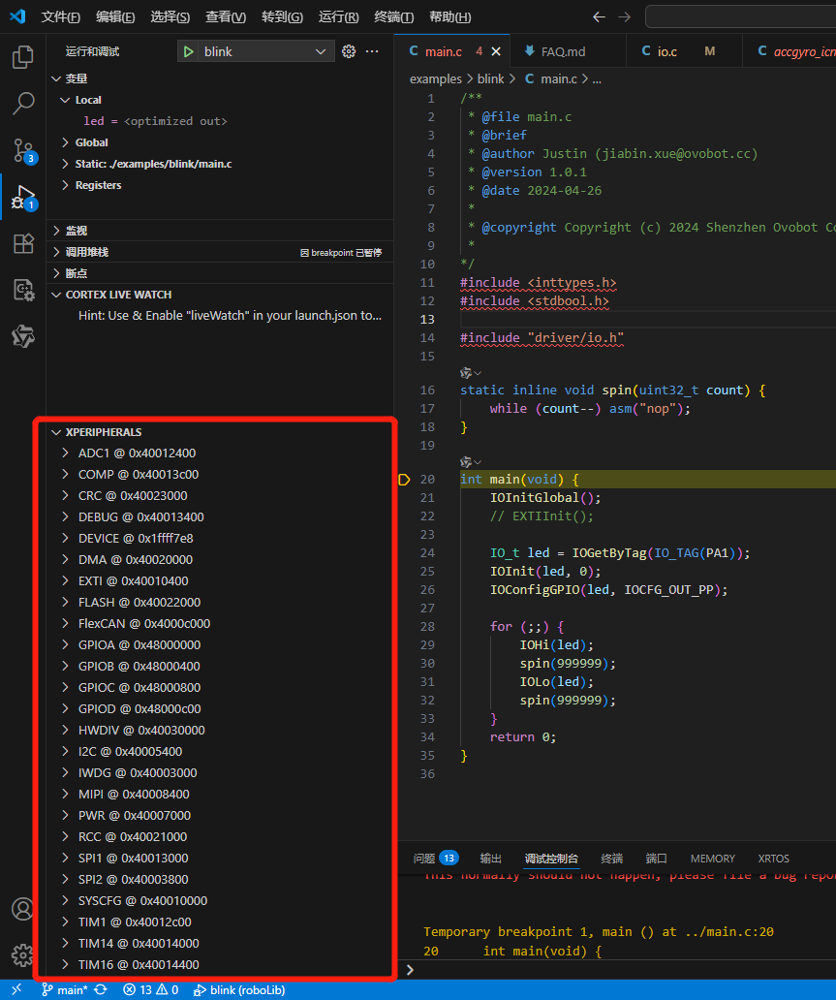

# VSCode在使用Cortex-Debug调试中查看芯片外设寄存器值

### @YUTONG 2025/07/16

## 1. 准备工作

### 1.1 安装必要软件
- **VSCode**  
  从[官网](https://code.visualstudio.com/)下载安装
- **Cortex-Debug 扩展**  
  在 VSCode 扩展市场搜索安装
- **调试工具链**  
  根据硬件选择安装：
  - OpenOCD
  - J-Link
  - ST-Link
- **芯片对应的 SVD 文件**  
  获取途径：
  - 厂商 SDK 包
  - Keil Pack（通常位于 `Keil_v5/ARM/PACK/厂商名/芯片系列_DFP`）

### 1.2 确认硬件连接
- 确保调试器（J-Link/ST-Link等）正确连接目标芯片
- 检查项目：
  - 芯片供电正常（3.3V/5V）
  - 调试接口（SWD/JTAG）连接正确
  - 复位电路正常

## 2. 配置 VSCode 调试环境

### 2.1 创建/配置 launch.json
1. 在 VSCode 中打开项目文件夹
2. 将芯片对应的svd文件添加到项目根目录



3. 进入 Run and Debug 视图：
   - 快捷键 `Ctrl+Shift+D`
   - 或点击左侧活动栏 ▶️🐞 图标
4. 创建配置文件：
   - 点击 `create a launch.json file`
   - 选择 `Cortex-Debug` 模板
5. 配置示例：

```json
{
    "version": "0.2.0",
    "configurations": [
        {
            "name": "blink",
            "cwd": "${workspaceRoot}",
            "executable": "examples\\blink\\gcc\\build\\blink.elf",
            "request": "launch",
            "type": "cortex-debug",
            "runToEntryPoint": "main",
            "servertype": "jlink",
            "interface": "swd",
            "device": "MM32F0144C6P",
            "toolchainPrefix": "arm-none-eabi",
            "liveWatch": {
                "enabled": true,
                "samplesPerSecond": 4
            },
            "svdFile":"examples\\blink\\gcc\\MM32F0140.svd"
        }
    ]
}
```
6. 配置运行结果：



