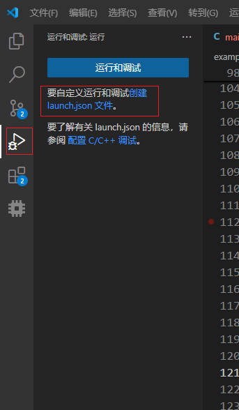
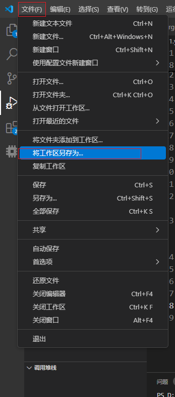
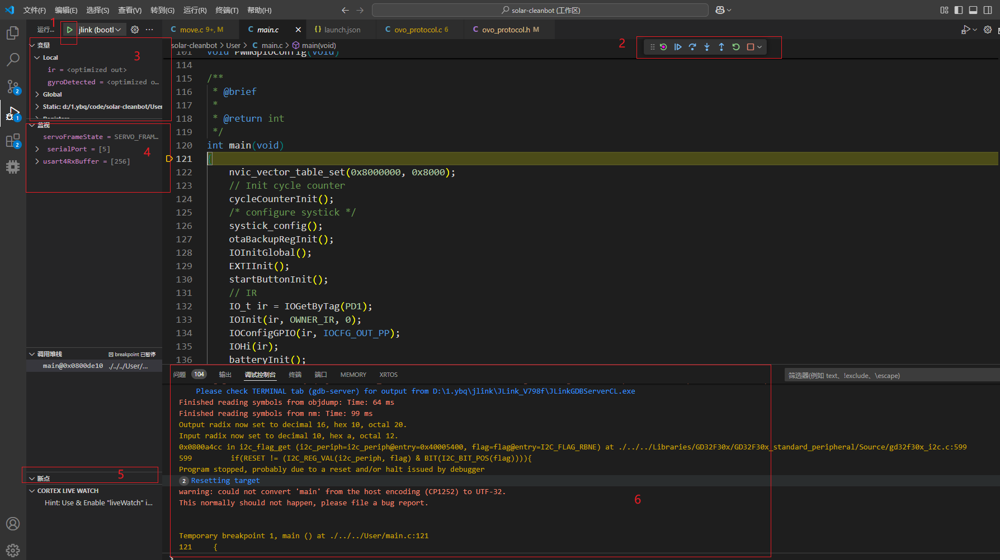

# VSCode调试功能使用

### 使用此功能必须拥有的工具
 * 下载 Arm GNU Toolchain  [连接](https://timye-development.readthedocs.io/en/latest/GNU/install-arm-none-eabi-gcc.html)
 * 确保 Arm GNU Toolchain下载完成并且相关的可执行程序注册到了**系统的环境变量**里
 * vsCode所用插件以及一些配置 参考 [连接](https://timye-development.readthedocs.io/en/latest/VSCode/VSCode%E7%94%A8EIDE%E7%BC%96%E8%AF%91%E9%A1%B9%E7%9B%AE.html)中的Cortex-Debug相关设置

### 调试文件配置
 * 打开调试信息配置文件launch.json文件，如下图所示
 
 * 将下列信息复制到文件中
 ```
     "version": "0.2.0",
     "configurations": [
        {
            "name": "jlink",
            "cwd": "${workspaceRoot}",
            "executable": "projects\\xbldc-03\\gcc_mm32spin0230\\build\\BLCD_driver.elf",
            "request": "launch",
            "type": "cortex-debug",
            "runToEntryPoint": "main",
            "servertype": "jlink",
            "interface": "swd",
            "device": "MM32F0020B1T",
            "toolchainPrefix": "arm-none-eabi"
        }
    ]
 ```
 注： 
 * "name" 是这一个调试功能的名称（一个项目可以设置多个）
 * "cwd" 是获取工作区路径，不需要修改
 * "executable" 是保存有芯片调试信息文件的路径，若设置了工作区可以使用相对路径，若未设置必须使用绝对路径
 * "device" 是芯片信息需要将你使用的芯片型号信息写入，前提是必须在jlink的device中能找到的芯片型号，若找不到所需的就用同内核、ram、flash的型号代替
不同的项目需要修改的就只有上述这几项，其余的可以适配不同的项目

### 工作区设置
根据下图将工作区放入所需目录


### 调试功能使用

上图解释：
 * 1 是进入调试模式
 * 2 是调试功能按钮，分别是：重启设备、启动/暂停、逐过程、单步调试、单步跳出、重启调试、结束调试
 * 3 是项目中的变量信息
 * 4 是可以将你需要时刻观察的变量放置在此处进行观察
 * 5 是所有打了断点处的信息
 * 6 是调试信息输出
